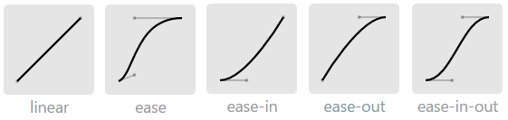

# transition
> transition

## 介绍
transition从效果上看是一种平滑过渡的动画，本质上是在线性时间内将属性从开始值过渡到结束值。例如获得焦点，点击鼠标等动作导致CSS属性值的变化是瞬间完成的，感觉有点生硬。用transition可以指定在某时间段内将属性值平滑过渡，增强用户体验。

## 4个子属性
* **transition-property**：指定需要过渡的CSS属性
并不是所有属性都能过渡的，只有能数字量化的CSS属性才能过渡

1. 颜色系，如color，background-color，border-color，outline-color等
2. 数字系，实在太多了，如width，height，top，right，bottom，left，zoom，opacity，line-height，background-position，word-spacing，font-weight，vertical-align，outline-outset，z-index等。
3. 01系，如visibility（0表示隐藏，1表示显示）
4. 等等，通常只要能设数字（包括%百分比）的属性都能过渡。

[可过渡属性一览表](https://link.jianshu.com/?t=https://www.w3.org/TR/css3-transitions/#animatable-css)

**除了单个指定属性外，transition-property还能设为all，表示所有属性都将获得过渡效果。**

* **transition-duration**：过渡需要的时间
单位可指定s秒，也可指定ms毫秒。默认值是0，表示立刻变化。如果设置了多个过渡属性，只需要设置一个时间即可，会过渡到所有属性上。

* **transition-timing-function**：过渡函数
有linear，ease，ease-in，ease-out，ease-in-out，cubic-bezier(n,n,n,n)，steps。其实它们都是贝赛尔曲线。如下


看贝赛尔曲线就知道了，linear是匀速过渡，ease是先快再慢的节奏，ease-in是加速冲刺的节奏，ease-out是减速到停止的节奏，ease-in-out是先加速后减速的节奏。

现在动画的精度越来越高，如果预定义好的这些函数满足不了你的需求，可以通过cubic-bezier(n,n,n,n)自定义平滑曲线。

* **transition-delay**：延迟开始过渡的时间
默认值是0，表示不延迟，立即开始过渡动作。单位是s秒或ms毫秒。

```
transition: background 1s linear 2s, border-radius 2s ease-in 3s;。
```

## 触发过渡的方式
* 伪类触发:hover，:focus，:active，:checked等
* @media媒体查询，根据设备大小，横屏竖屏切换时触发。
* click，keydown等JS事件触发
* 页面加载也能触发

### transitionend事件
ransition既然涉及时间，自然就有事件。参照MDN有transitionend事件，顾名思义就是过渡结束时触发该事件。但该事件比较坑。例如过渡padding时
```
#tempDiv {
    padding: 1px;
    transition-property: padding;
    transition-duration: 1s;
}
#tempDiv:hover {
    padding: 5px;
}
function showMessage() {
    console.log('finished');    //过渡结束时触发打印log
}
var element = document.getElementById("tempDiv");
element.addEventListener("transitionend", showMessage, false);
```
你可以代码贴到浏览器里试试，结果出现4条log。因为过渡属性指定的是padding，所以在padding-top，padding-right，padding-bottom，padding-left过渡结束时均触发了transitionend事件。因此log被打印了4次。

如果上述CSS中将transition-property: padding;改为all，同样会触发4次。除非你改成transition-property: padding-top;这样才能只触发一次，但现实中只过渡一边的场景非常少，通常都是4边同时过渡，因此例如padding，margin，border之类的属性，用transitionend事件会有多次捕捉的情况发生。

### 隐式过渡
设成em的属性，如你所知em是根据font-size来计算的。类似还有rem，vh，vw等都是根据另一个属性的值来计算得到它的值。举个例子padding:2em;，如果font-size被改变了，此时padding的“书面值”不变，仍旧是2em，但“实际值”将会发生变化并触发transition过渡。

### 开关过渡和永久过渡
开关过渡，顾名思义就是触发源的事件结束后会恢复到原始状态。永久过渡就是过渡后不恢复到原始状态。上面的例子都是开关过渡，当鼠标hover事件结束后，图片恢复原始尺寸。但永久过渡的话，鼠标hover事件结束后，图片仍旧保持放大后的尺寸。
```css
//开关过渡
.transition { 
    transition: all 1s ease-in-out;
}
.transition:hover {
    transform: scale(1.5);
}
//永久过渡
.forever { 
    transition: all 1s ease-in-out 999999s;
}
.forever:hover { 
    transform: scale(1.5);
    transition: all 1s ease-in-out;
}
```
因为回到原始尺寸的transition-duration被设成了一个很大的时间，999999s差不多有12天，理论上你页面开12天就能看到关闭过渡的效果，但现实等于永久过渡。该技巧无需任何JS脚本。

### auto过渡
## 来源
[CSS3 transition介绍](https://www.jianshu.com/p/56f8ddafc63f)