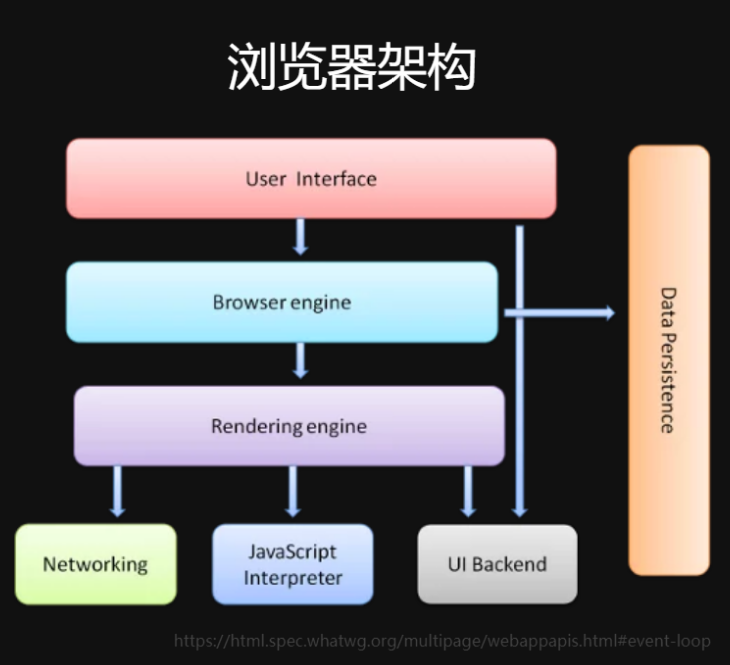
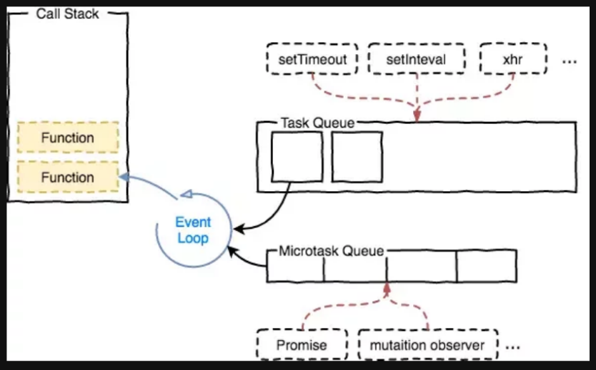
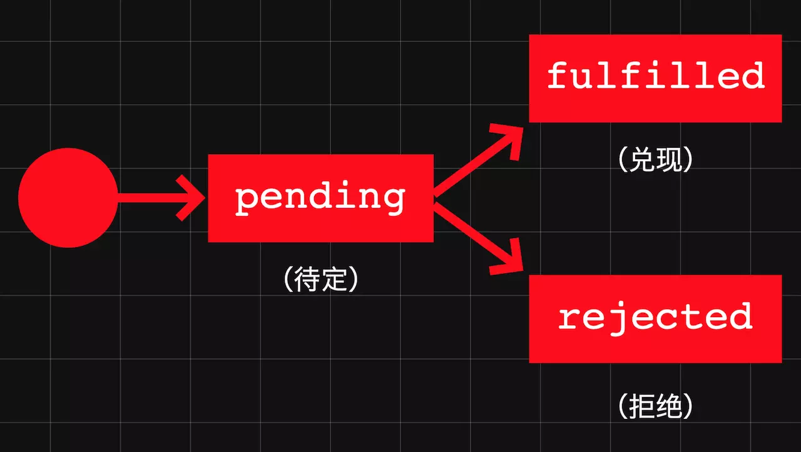
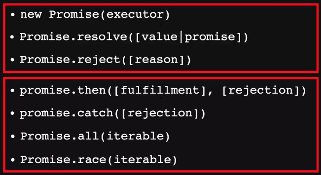
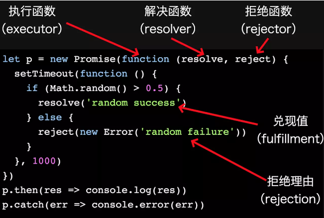
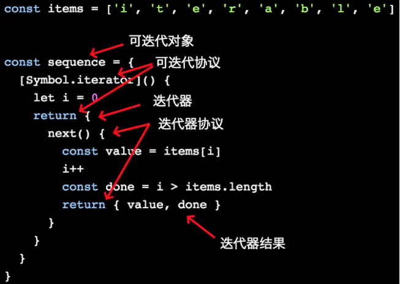

# 异步
> async

## 异步编程
### 浏览器架构


### 调用栈、事件循环与任务队列


### ES6之前的异步机制：事件
```js
var req = new XMLHttpRequest();
req.open('GET',url);

req.onload = function(){
  if(req.status == 200){
    processData(req.response);
  }
};


req.onerror = function(){
  console.log('Network Error');
};

req.send(); // 把请求添加到任务队列
```

### ES6之前的异步机制：回调
```js
// Node.js
fs.readFile('file.txt',function(err.data){
  if(err){
    // ...
  }
  console.log(data);
});
```

### 上述异步实现方式的缺点
1. 事件只适用于简单交互，嵌套或连缀多个异步调用，会导致代码复杂，因为必须跟踪每个事件的事件目标
2. 嵌套只适用于简单交互，嵌套过多就会造成代码难以理解，难以理解就难以维护难以调试

总之，无法解决可能出现的地狱0回调的问题

### ES7：Asyn Function
```js
async function example () {
  const r1 = await new Promise(resolve =>
    setTimeout(resolve, 500, 'slowest')
  )

  const r2 = await new Promise(resolve =>
    // setTimeout的第三个参数是作为一个参数func()的参数传进去的
    setTimeout(resolve, 200, 'slow')
  )
  return [r1, r2]
}

example().then(result => console.log(result))

// ['slowest','slow']
```
Async函数需要在function前面添加async关键字，同时内部以await关键字来“阻塞”异步操作，直到异步操作返回结果，然后再继续执行。

## Async 原理
### Async function = Promise + Iterator + Generator （ PIG )

### Promise
Promise，人们普遍的理解就是：“Promise是一个未来值的占位符”。也就是说，从语义上讲，一个Promise对象代表一个对未来值的“承诺”（promise），这个承诺将来如果“兑现”（fulfill），就会“解决”（resolve）为一个有意义的数据；如果“拒绝”（reject），就会“解决”为一个“拒绝理由”（rejection reason），就是一个错误消息。

Promise对象的状态很简单，一生下来的状态是pending（待定），将来兑现了，状态变成fulfilled；拒绝了，状态变成rejected。fulfilled和rejected显然是一种“确定”（settled）状态。以上状态转换是不可逆的，所以Promise很单纯，好控制。




以下是Promise相关的所有API。前3个是创建Promise对象的（稍后有例子），后4个中的前2个是用于注册反应函数的（稍后有例子），后2个是用于控制并发和抢占的：



以下是通过Prmoise(executor)构造函数创建Promise实例的详细过程：要传入一个“执行函数”（executor），这个执行函数又接收两个参数“解决函数”（resolver）和“拒绝函数”（rejector），代码中分别对应变量resolve和reject，作用分别是将新建对象的状态由pending改为fulfilled和rejected，同时返回“兑现值”（fulfillment）和“拒绝理由”（rejection）。当然，resolve和reject都是在异步操作的回调中调用的。调用之后，运行时环境（浏览器引擎或Node.js的libuv）中的事件循环调度机制会把与之相关的反应函数——兑现反应函数或拒绝反应函数以及相关的参数添加到“微任务”队列，以便下一次“循检”（tick）时调度到JavaScript线程去执行。



如前所述，Promise对象的状态由pending变成fulfilled，就会执行“兑现反应函数”（fulfillment reaction）；而变成rejected，就会执行“拒绝反应函数”（rejection reaction）。如下例所示，常规的方式是通过p.then()注册兑现函数，通过p.catch()注册拒绝函数：

```js
p.then(res => { // 兑现反应函数
  // res === 'random success'
})
p.catch(err => { // 拒绝反应函数
  // err === 'random failure'
})
```

当然还有非常规的方式，而且有时候非常规方式可能更好用：

```js
// 通过一个.then()方法同时注册兑现和拒绝函数
p.then(
  res => {
    // handle response
  },
  err => {
    // handle error
  }
)
// 通过.then()方法只注册一个函数：兑现函数
p.then(res => {
  // handle response
})
// 通过.then()方法只传入拒绝函数，兑现函数的位置传null
p.then(null, err => {
  // handle error
})
```

### Iterator
要理解Iterator或者迭代器，最简单的方式是看它的接口：

```js
interface IteratorResult {
  done: boolean;
  value: any;
}
interface Iterator {
  next(): IteratorResult;
}
interface Iterable {
  [Symbol.iterator](): Iterator
}
```

先从中间的Iterator看。

什么是迭代器？它是一个对象，有一个next()方法，每次调用next()方法，就会返回一个迭代器结果（看第一个接口IteratorResult）。而这个迭代器结果，同样还是一个对象，这个对象有两个属性：done和value，其中done是一个布尔值，false表示迭代器迭代的序列没有结束；true表示迭代器迭代的序列结束了。而value就是迭代器每次迭代真正返回的值。

再看最后一个接口Iterable，翻译成“可迭代对象”，它有一个```[Symbol.iterator]()```方法，这个方法会返回一个迭代器。

可以结合前面的接口定义和下面这张图来理解可迭代对象（实现了“可迭代协议”）、迭代器（实现了“迭代器协议”）和迭代器结果这3个简单而又重要的概念（暂时理解不了也没关系，后面还有一个无穷序列的例子，可以帮助大家理解）。




## 异步
> 不会阻塞后面程序的运行，JS 需要异步的根本原因是 JS 是单线程运行的

```
var a = true;
setTimeout(function(){
    a = false;
}, 100)
while(a){
    console.log('while执行了')
}
```
因为JS是单线程的，所以进入while循环之后，没有「时间」（线程）去跑定时器了，所以这个代码跑起来是个死循环

## 前端异步场景
* 定时 setTimeout setInterval
* 网络请求，如 Ajax 加载

img 代码示例（常用于打点统计）
```
console.log('start')
var img = document.createElement('img')
// 或者 img = new Image()
img.onload = function () {
    console.log('loaded')
    img.onload = null
}
img.src = '/xxx.png'
console.log('end')
```
 需求:统计用户页面某处的点击数或者执行到程序中某个点的次数 特点:根据实际情况,创建多个Image对象,原则谁空闲谁做事。

## async 和 await
一个函数如果加上 async ，那么该函数就会返回一个 Promise
```
async function test() {
  return "1";
}
console.log(test()); // -> Promise {<resolved>: "1"}
```
可以把 async 看成将函数返回值使用 Promise.resolve() 包裹了下。

await 只能在 async 函数中使用
```
function sleep() {
  return new Promise(resolve => {
    setTimeout(() => {
      console.log('finish')
      resolve("sleep");
    }, 2000);
  });
}
async function test() {
  let value = await sleep();
  console.log("object");
}
test()
//finish  
//object
```
上面代码会先打印 finish 然后再打印 object 。因为 await 会等待 sleep 函数 resolve ，所以即使后面是同步代码，也不会先去执行同步代码再来执行异步代码。

async 和 await 相比直接使用 Promise 来说，优势在于处理 then 的调用链，能够更清晰准确的写出代码。缺点在于滥用 await 可能会导致性能问题，因为 await 会阻塞代码，也许之后的异步代码并不依赖于前者，但仍然需要等待前者完成，导致代码失去了并发性。
```
var a = 0
var b = async () => {
  a = a + await 10
  console.log('2', a) // -> '2' 10
  a = (await 10) + a
  console.log('3', a) // -> '3' 20
}
b()
a++
console.log('1', a) // -> '1' 1
```
* 首先函数 b 先执行，在执行到 await 10 之前变量 a 还是 0，因为在 await 内部实现了 generators ，generators 会保留堆栈中东西，所以这时候 a = 0 被保存了下来
* 因为 await 是异步操作，所以会先执行 console.log('1', a)
* 这时候同步代码执行完毕，开始执行异步代码，将保存下来的值拿出来使用，这时候 a = 10
* 然后后面就是常规执行代码了