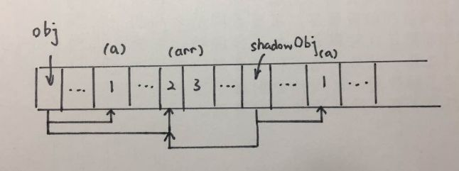
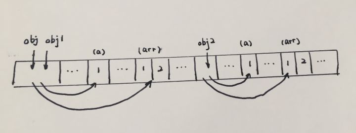

# 拷贝
> copy
## 基本类型&引用类型
ECMAScript中的数据类型可分为两种：

* 基本类型：undefined,null,Boolean,String,Number,Symbol
* 引用类型：Object,Array,Date,Function,RegExp等

不同类型的存储方式：
* 基本类型：**基本类型值**在内存中占据固定大小，保存在**栈内存**中
* 引用类型：**引用类型的值**是对象，保存在**堆内存**中，而**栈内存**存储的是**对象的变量标识符**以及**对象在堆内存中的存储地址**

不同类型的复制方式：
* 基本类型：从一个变量向另外一个新变量复制基本类型的值，会创建这个值的一个副本，并将该副本复制给新变量
```js
let foo = 1;
let bar = foo;
console.log(foo === bar); // -> true

// 修改foo变量的值并不会影响bar变量的值
let foo = 233;
console.log(foo); // -> 233
console.log(bar); // -> 1
```

* 引用类型：从一个变量向另一个新变量复制引用类型的值，其实复制的是指针，最终两个变量最终都指向同一个对象
```js
let foo = {
  name: 'leeper',
  age: 20
}
let bar = foo;
console.log(foo === bar); // -> true

// 改变foo变量的值会影响bar变量的值
foo.age = 19;
console.log(foo); // -> {name: 'leeper', age: 19}
console.log(bar); // -> {name: 'leeper', age: 19}
```

## 拷贝
* 浅拷贝：仅仅是复制了引用，彼此之间的操作会互相影响
* 深拷贝：在堆中重新分配内存，不同的地址，相同的值，互不影响

首先深复制和浅复制只针对像 Object, Array 这样的复杂对象的。简单来说，**浅复制只复制一层对象的属性**，而**深复制则递归复制了所有层级**。

## 浅拷贝
### 讨论 JavaScript 提供的方法
* Array.prototype.slice()
```js
let a = [1, 2, 3, 4];
let b = a.slice();
console.log(a === b); // -> false

a[0] = 5;
console.log(a); // -> [5, 2, 3, 4]
console.log(b); // -> [1, 2, 3, 4]
```

* Array.prototype.concat()
```js
let a = [1, 2, 3, 4];
let b = a.concat();
console.log(a === b); // -> false

a[0] = 5;
console.log(a); // -> [5, 2, 3, 4]
console.log(b); // -> [1, 2, 3, 4]
```

看起来Array的slice(),concat()似乎是深拷贝，再接着看就知道它们究竟是深拷贝还是浅拷贝：

```js
let a = [[1, 2], 3, 4];
let b = a.slice();
console.log(a === b); // -> false

a[0][0] = 0;
console.log(a); // -> [[0, 2], 3, 4]
console.log(b); // -> [[0, 2], 3, 4]
```
同样，对于concat()也进行验证:
```js
let a = [[1, 2], 3, 4];
let b = a.concat();
console.log(a === b); // -> false

a[0][0] = 0;
console.log(a); // -> [[0, 2], 3, 4]
console.log(b); // -> [[0, 2], 3, 4]
```
综上， Array 的 slice 和 concat 方法并不是真正的深拷贝，对于 Array 的第一层的元素是深拷贝，而 Array 的第二层  slice 和 concat 方法是复制引用。所以，Array 的 slice 和 concat 方法都是浅拷贝。

### 实现浅拷贝
```js
// 使用Object.assign解决
// 使用Object.assign()，你就可以没有继承就能获得另一个对象的所有属性，快捷好用。 
// Object.assign 方法只复制源对象中可枚举的属性和对象自身的属性。
let obj = { a:1, arr:[2,3]};
let res = Object.assign({}, obj)

console.log(res.arr === obj.arr); // true，指向同一个引用
```
```js
// 使用扩展运算符（…）来解决
let obj = { a:1, arr:[2,3]};
let res = {...obj};

console.log(res.arr === obj.arr); // true，指向同一个引用
```
```js
const shallowCopy = (sourceObj) => {
  if (typeof sourceObj !== 'object') return;
  let newObj = sourceObj instanceof Array ? [] : {};
  
  for(let key in sourceObj){ 
    if(sourceObj.hasOwnProperty(item)) {
     //只复制元素自身的属性，不复制原型链上的
      if(!(key in newObj)){
        newObj[key] = sourceObj[key];
      }
    }
  }
  return newObj;
}

let obj = { a:1, arr:[2,3]};
let res = shallowCopy(obj);
console.log(res.arr === obj.arr); // true，指向同一个引用
```

因为浅复制只会将对象的各个属性进行依次复制，并不会进行递归复制，而 JavaScript 存储对象都是存地址的，所以浅复制会导致 obj.arr 和 shallowObj.arr 指向同一块内存地址，大概的示意图如下。



## 深拷贝
1. JSON.stringify()：把一个js对象序列化为一个JSON字符串
2. JSON.parse()：把JSON字符串反序列化为一个js对象
```js
// 可以通过 JSON.parse(JSON.stringify(object)) 来解决
let a = {
    age: 1,
    jobs: {
        first: 'FE'
    }
}
let b = JSON.parse(JSON.stringify(a))
a.jobs.first = 'native'
console.log(b.jobs.first) // FE
```
但是该方法也是有局限性的：

* 会忽略 undefined
* 不能序列化函数（会忽略函数）
* 不能解决循环引用的对象

并且该函数是内置函数中处理深拷贝性能最快的。当然如果你的数据中含有以上三种情况下，可以使用 lodash 的深拷贝函数。

如果你所需拷贝的对象含有内置类型并且不包含函数，可以使用 MessageChannel
```js
function structuralClone(obj) {
  return new Promise(resolve => {
    const {port1, port2} = new MessageChannel();
    port2.onmessage = ev => resolve(ev.data);
    port1.postMessage(obj);
  });
}

var obj = {a: 1, b: {
    c: b
}}
// 注意该方法是异步的
// 可以处理 undefined 和循环引用对象
const clone = await structuralClone(obj);
```

```js
const deepCopy = (sourceObj) => {
  if(typeof sourceObj !== 'object') return;
  let newObj = sourceObj instanceof Array ? [] : {};
  
  for(let item in sourceObj){
    if(sourceObj.hasOwnProperty(item)) {
     //只复制元素自身的属性，不复制原型链上的
      newObj[item] = (typeof sourceObj[item] === 'object' ? deepCopy(sourceObj[item]) : sourceObj[item]);
     }
   }
   return newObj;
}

let obj = { a:1, arr:[2,3]};
let res = deepCopy(obj);
console.log(res.arr === obj.arr); // true，指向同一个引用
```
而深复制则不同，它不仅将原对象的各个属性逐个复制出去，而且将原对象各个属性所包含的对象也依次采用深复制的方法递归复制到新对象上。这就不会存在上面 obj 和 shallowObj 的 arr 属性指向同一个对象的问题。 

