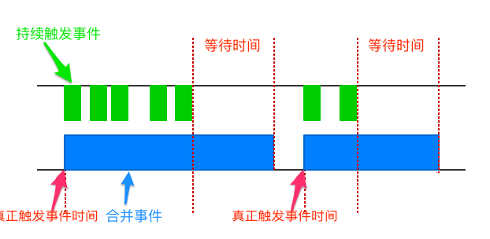
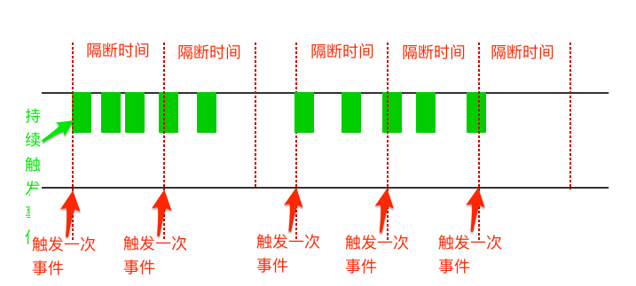

# 防抖和节流
窗口的resize、scroll、输入框内容校验等操作时，如果这些**操作处理函数**是较为复杂或页面频繁重渲染等操作时，在这种情况下如果事件触发的频率无限制，会加重浏览器的负担，导致用户体验非常糟糕。此时我们可以采用debounce（防抖）和throttle（节流）的方式来**减少触发的频率**，同时又不影响实际效果。

eg：搜索框的请求优化，输入搜索词条需要立即触发搜索请求时，防抖和节流可以将多个请求合并为一个请求

[github前端笔记传送门](https://github.com/sophiayang1997/notebook)，走过路过 star 一个？

首先准备 html 文件中代码如下：
```html
<div id="content" style="height:150px;line-height:150px;text-align:center; color: #fff;background-color:#ccc;font-size:80px;"></div>
<script>
    var num = 1;
    var content = document.getElementById('content');

    function count() {
        content.innerHTML = num++;
    };

    content.onmousemove = count;
</script>

```
## 防抖
debounce（防抖），简单来说就是防止抖动。

当持续触发事件时，debounce 会**合并事件且不会去触发事件**，**当一定时间内没有触发再这个事件时，才真正去触发事件**。

### 非立即执行版


非立即执行版的意思是触发事件后函数不会立即执行，而是在 n 秒后执行，如果在 n 秒内又触发了事件，则会重新计算函数执行时间。

```js
const debounce = (func, wait, ...args) => {
  let timeout;
  return function(){
    const context = this;
    if (timeout) clearTimeout(timeout);
    timeout = setTimeout(() => {
      func.apply(context, args)
    },wait);
  }
}
```
如此调用：
```js
content.onmousemove = debounce(count,1000);
```


### 立即执行版



立即执行版的意思是触发事件后函数会立即执行，然后 n 秒内不触发事件才能继续执行函数的效果。

```js
const debounce = (func, wait, ...args) => {
  let timeout;
  return function(){
    const context = this;
    if (timeout) cleatTimeout(timeout);
    let callNow = !timeout;
    timeout = setTimeout(() => {
      timeout = null;
    },wait)
    
    if(callNow) func.apply(context,args)
   }
}
```


### 结合版
```js
/**
 * @desc 函数防抖
 * @param func 函数
 * @param wait 延迟执行毫秒数
 * @param immediate true 表立即执行，false 表非立即执行
 */
function debounce(func,wait,immediate) {
    var timeout;

    return function () {
        var context = this;
        var args = arguments;

        if (timeout) clearTimeout(timeout);
        if (immediate) {
            var callNow = !timeout;
            timeout = setTimeout(function(){
                timeout = null;
            }, wait)
            if (callNow) func.apply(context, args)
        }
        else {
            timeout = setTimeout(function(){
                func.apply(context, args)
            }, wait);
        }
    }
}
```

## 节流
throttle（节流），当持续触发事件时，保证隔间时间触发一次事件。

持续触发事件时，throttle 会合并一定时间内的事件，并在该时间结束时真正去触发一次事件。

### 时间戳版



在持续触发事件的过程中，函数会立即执行，并且每 1s 执行一次。

```js
const throttle = (func, wait, ...args) => {
  let pre = 0;
  return function(){
    const context = this;
    let now = Date.now();
    if (now - pre >= wait){
       func.apply(context, args);
       pre = Date.now();
    }
  }
}
```


### 定时器版


在持续触发事件的过程中，函数不会立即执行，并且每 1s 执行一次，在停止触发事件后，函数还会再执行一次。

```js
const throttle = (func, wait, ...args) => {
  let timeout;
  return function(){
    const context = this;
    if(!timeout){
      timeout = setTimeout(function(){
        timeout = null;
        func.apply(context,args);
      },wait)
    }
  }
}
```


### 结合版
其实时间戳版和定时器版的节流函数的区别就是，时间戳版的函数触发是在时间段内开始的时候，而定时器版的函数触发是在时间段内结束的时候。
```js
/**
 * @desc 函数节流
 * @param func 函数
 * @param wait 延迟执行毫秒数
 * @param type 1 表时间戳版，2 表定时器版
 */
function throttle(func, wait ,type) {
    if(type===1){
        var previous = 0;
    }else if(type===2){
        var timeout;
    }

    return function() {
        var context = this;
        var args = arguments;
        if(type===1){
            var now = Date.now();

            if (now - previous > wait) {
                func.apply(context, args);
                previous = now;
            }
        }else if(type===2){
            if (!timeout) {
                timeout = setTimeout(function(){
                    timeout = null;
                    func.apply(context, args)
                }, wait)
            }
        }

    }
}
```

## underscore 源码
```js
/**
 * underscore 防抖函数，返回函数连续调用时，空闲时间必须大于或等于 wait，func 才会执行
 *
 * @param  {function} func        回调函数
 * @param  {number}   wait        表示时间窗口的间隔
 * @param  {boolean}  immediate   设置为ture时，是否立即调用函数
 * @return {function}             返回客户调用函数
 */
_.debounce = function(func, wait, immediate) {
    var timeout, args, context, timestamp, result;

    var later = function() {
      // 现在和上一次时间戳比较
      var last = _.now() - timestamp;
      // 如果当前间隔时间少于设定时间且大于0就重新设置定时器
      if (last < wait && last >= 0) {
        timeout = setTimeout(later, wait - last);
      } else {
        // 否则的话就是时间到了执行回调函数
        timeout = null;
        if (!immediate) {
          result = func.apply(context, args);
          if (!timeout) context = args = null;
        }
      }
    };

    return function() {
      context = this;
      args = arguments;
      // 获得时间戳
      timestamp = _.now();
      // 如果定时器不存在且立即执行函数
      var callNow = immediate && !timeout;
      // 如果定时器不存在就创建一个
      if (!timeout) timeout = setTimeout(later, wait);
      if (callNow) {
        // 如果需要立即执行函数的话 通过 apply 执行
        result = func.apply(context, args);
        context = args = null;
      }

      return result;
    };
  };
```
* 对于按钮防点击来说的实现：一旦我开始一个定时器，只要我定时器还在，不管你怎么点击都不会执行回调函数。一旦定时器结束并设置为 null，就可以再次点击了。
* 对于延时执行函数来说的实现：每次调用防抖动函数都会判断本次调用和之前的时间间隔，如果小于需要的时间间隔，就会重新创建一个定时器，并且定时器的延时为设定时间减去之前的时间间隔。一旦时间到了，就会执行相应的回调函数。


```js
/**
 * underscore 节流函数，返回函数连续调用时，func 执行频率限定为 次 / wait
 *
 * @param  {function}   func      回调函数
 * @param  {number}     wait      表示时间窗口的间隔
 * @param  {object}     options   如果想忽略开始函数的的调用，传入{leading: false}。
 *                                如果想忽略结尾函数的调用，传入{trailing: false}
 *                                两者不能共存，否则函数不能执行
 * @return {function}             返回客户调用函数   
 */
_.throttle = function(func, wait, options) {
    var context, args, result;
    var timeout = null;
    // 之前的时间戳
    var previous = 0;
    // 如果 options 没传则设为空对象
    if (!options) options = {};
    // 定时器回调函数
    var later = function() {
      // 如果设置了 leading，就将 previous 设为 0
      // 用于下面函数的第一个 if 判断
      previous = options.leading === false ? 0 : _.now();
      // 置空一是为了防止内存泄漏，二是为了下面的定时器判断
      timeout = null;
      result = func.apply(context, args);
      if (!timeout) context = args = null;
    };
    return function() {
      // 获得当前时间戳
      var now = _.now();
      // 首次进入前者肯定为 true
	  // 如果需要第一次不执行函数
	  // 就将上次时间戳设为当前的
      // 这样在接下来计算 remaining 的值时会大于0
      if (!previous && options.leading === false) previous = now;
      // 计算剩余时间
      var remaining = wait - (now - previous);
      context = this;
      args = arguments;
      // 如果当前调用已经大于上次调用时间 + wait
      // 或者用户手动调了时间
 	  // 如果设置了 trailing，只会进入这个条件
	  // 如果没有设置 leading，那么第一次会进入这个条件
	  // 还有一点，你可能会觉得开启了定时器那么应该不会进入这个 if 条件了
	  // 其实还是会进入的，因为定时器的延时
	  // 并不是准确的时间，很可能你设置了2秒
	  // 但是他需要2.2秒才触发，这时候就会进入这个条件
      if (remaining <= 0 || remaining > wait) {
        // 如果存在定时器就清理掉否则会调用二次回调
        if (timeout) {
          clearTimeout(timeout);
          timeout = null;
        }
        previous = now;
        result = func.apply(context, args);
        if (!timeout) context = args = null;
      } else if (!timeout && options.trailing !== false) {
        // 判断是否设置了定时器和 trailing
	    // 没有的话就开启一个定时器
        // 并且不能不能同时设置 leading 和 trailing
        timeout = setTimeout(later, remaining);
      }
      return result;
    };
  };
```

## 文章来源
* [函数防抖和节流](https://juejin.im/post/5b651dc15188251aa30c8669)
* [JS简单实现防抖 - debounce和节流 - throttle](http://www.php.cn/js-tutorial-407389.html)

