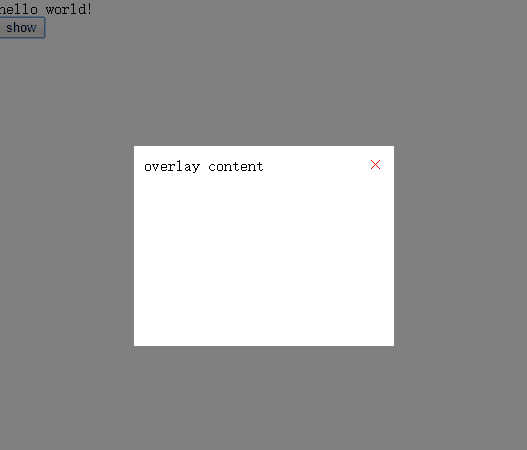

# React16的新特性
> react16

* Error Boundary
* render方法新增返回类型
* Portals
* 支持自定义DOM属性
* setState传入null时不会再触发更新
* 更好的服务器端渲染
* 新的打包策略
* ...

## 使用Error Boundary处理错误组件
之前，**一旦某个组件发生错误，整个组件树将会从根节点被unmount下来**。React 16修复了这一点，引入了Error Boundary的概念，中文译为“错误边界”，**当某个组件发生错误时，我们可以通过Error Boundary捕获到错误并对错误做优雅处理，如使用Error Boundary提供的内容替代错误组件**。Error Boundary可以看作是一种特殊的React组件，**新增了componentDidCatch这个生命周期函数**，**它可以捕获自身及子树上的错误并对错误做优雅处理**，包括上报错误日志、展示出错提示，而不是卸载整个组件树。（注：它并不能捕获runtime所有的错误，比如组件回调事件里的错误，可以把它想象成传统的try-catch语句）

```js
//最佳实践：将ErrorBoundary抽象为一个公用的组件类

import React, { Component } from 'react'

export default class ErrorBoundary extends Component {
    constructor(props) {
        super(props)
        this.state = { hasError: false }
    }
    componentDidCatch(err, info) {
        this.setState({ hasError: true })
        //sendErrorReport(err,info)
    }
    render(){
        if(this.state.hasError){
            return <div>Something went wrong!</div>
        }
        return this.props.children
    }
}
```
我们可以在容易出错的组件外使用ErrorBoundary将它包裹起来，如下
```js
//使用方式
render(){
    return (
        <div>
            <ErrorBoundary>
                <Profile user={this.state.user} />
            </ErrorBoundary>
            <button onClick={this.onClick}>Update</button>
        </div>
    )
}
```
如果Profile组件发生错误，将会使用ErrorBoundary提供的<div>Something went wrong</div>代替它，而不会引起整个组件树的卸载。

## render方法新增返回类型
在React 16中，render方法支持直接返回string，number，boolean，null，portal，以及fragments(带有key属性的数组)，这可以在一定程度上减少页面的DOM层级。
```js
//string
render(){
    return 'hello,world'
}

//number
render(){
    return 12345
}

//boolean
render(){
    return isTrue?true:false
}

//null
render(){
    return null
}

//fragments，未加key标识符，控制台会出现warning
render(){
    return [
        <div>hello</div>,
        <span>world</span>,
        <p>oh</p>
    ]
}
```
以上各种类型现在均可以直接在render中返回，不需要再在外层包裹一层容器元素，不过在返回的数组类型中，需要在每个元素上加一个唯一且不变的key值，否则控制台会报一个warning。

## 使用createPortal将组件渲染到当前组件树之外
Portals机制提供了一种**最直接**的方式可以把一个子组件渲染到父组件渲染的DOM树之外。默认情况下，React组件树和DOM树是完全对应的，因此对于一些Modal,Overlay之类的组件，通常是将它们放在顶层，但逻辑上它们可能只是属于某个子组件，不利于组件的代码组织。通过使用createPortal，我们可以将组件渲染到我们想要的任意DOM节点中，但该组件依然处在React的父组件之内。带来的一个特性就是，**在子组件产生的event依然可以被React父组件捕获，但在DOM结构中，它却不是你的父组件**。对于组件组织，代码切割来说，这是一个很好的属性。

```
//实现一个简易蒙层效果，抽象出一个通用的Overlay组件
import React, { Component } from 'react';
import ReactDOM from 'react-dom';

export default class Overlay extends Component {
    constructor(props) {
        super(props);
        this.container = document.createElement('div');
        document.body.appendChild(this.container);
    }
    componentWillUnmount() {
        document.body.removeChild(this.container);
    }
    render() {
        return ReactDOM.createPortal(
            <div className='overlay'>
                <span className='overlay-close' onClick={this.props.onClose}>&times;</span>
                {this.props.children}
            </div>,
            this.container
        )
    }
}
//该组件对应的样式如下
.overlay{
    box-sizing:border-box;
    position: fixed;
    top:50%;
    left:50%;
    width:260px;
    height:200px;
    margin-left:-130px;
    margin-top:-100px;
    padding:10px;
    background-color: #fff;
    outline: rgba(0,0,0,.5) solid 9999px;
}
.overlay-close{
    position: absolute;
    top:10px;
    right:10px;
    color:red;
    cursor: pointer;
}
```
使用方式如下：
```
class App extends Component {
  constructor(props) {
    super(props);
    this.state = {
      overlayActive: false
    }
    this.closeOverlay = this.closeOverlay.bind(this);
    this.showOverlay = this.showOverlay.bind(this);
  }
  closeOverlay() {
    this.setState({ overlayActive: false })
  }
  showOverlay() {
    this.setState({ overlayActive: true })
  }
  render() {
    return (
      <div className="App">
        <div>hello world!</div>
        {this.state.overlayActive &&
          <Overlay onClose={this.closeOverlay}>overlay content</Overlay>}
        <button onClick={this.showOverlay}>show</button>
      </div>
    );
  }
}
```



## 支持自定义DOM属性
在之前的版本中，React会忽略无法识别的HTML和SVG属性，自定义属性只能通过data-*形式添加，现在它会把这些属性直接传递给DOM（这个改动让React可以去掉属性白名单，从而减少了文件大小），不过有些写法仍然是无效的。如DOM传递的自定义属性是函数类型或event handler时，依然会被React忽略。
```js
//错误写法
render(){
    return(
        <div a={()=>{}} onclick={this.showOverlay}></div>
    )
)
//Warning: Invalid event handler property `onclick`. Did you mean `onClick`?
//Warning: Invalid value for prop `a` on <div> tag. Either remove it from the element, or pass a string or number value to keep it in the DOM.
```

## setState传入null时不会再触发更新
比如在一个选择城市的函数中，当点击某个城市时，newValue的值可能发生改变，也可能是点击了原来的城市，值没有变化，返回null则可以直接避免触发更新，不会引起重复渲染，不需要在shouldComponentUpdate函数里面去判断。
```js
selectCity(e){
    const newValue = e.target.value;
    this.setState((state)=>{
        if(state.city===newValue){
            return null;
        }
        return {city:newValue}
    })
)
```
注意：现在setState回调（第二个参数）会在componentDidMount/componentDidUpdate后立即触发，而不是等到所有组件渲染完成之后。

## 更好的服务器端渲染
React 16的SSR被完全重写，新的实现非常快，接近3倍性能于React 15，现在提供一种流模式streaming，可以更快地把渲染的字节发送到客户端。另外，React 16在hydrating(注：指在客户端基于服务器返回的HTML再次重新渲染）方面也表现的更好，React 16不再要求客户端的初始渲染完全和服务器返回的渲染结果一致，而是尽量重用已经存在的DOM元素。不会再有checksum（标记验证）！并对不一致发出警告。一般来说，在服务器和客户端渲染不同的内容是不建议的，但这样做在某些情况下也是有用的（比如，生成timestamp)。

## 新的打包策略
新的打包策略中去掉了process.env检查。
React 16的体积比上个版本减小了32%（30% post-gzip），文件尺寸的减小一部分要归功于打包方法的改变。

> react is 5.3 kb (2.2 kb gzipped), down from 20.7 kb (6.9 kb gzipped).react-dom is 103.7 kb (32.6 kb gzipped), down from 141 kb (42.9 kb gzipped).react + react-dom is 109 kb (34.8 kb gzipped), down from 161.7 kb (49.8 kb gzipped).

写在最后，React 16采用了新的核心架构React Fiber。官方解释是“React Fiber是对核心算法的一次重新实现”，后续再深入学习。
