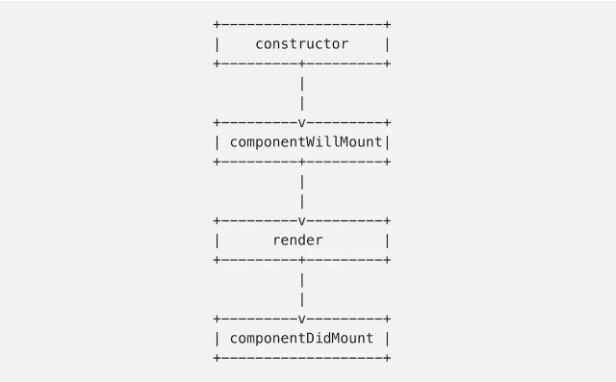
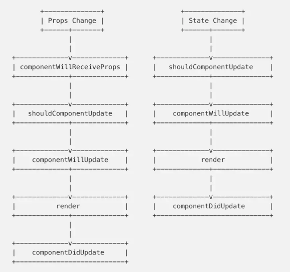

# React 中的 setState
* [我希望在深入React之前了解这些](#我希望在深入React之前了解这些)
* [React中setState为什么是异步的](#React中setState为什么是异步的)
* [React中setState同步更新策略](#React中setState同步更新策略)

## 我希望在深入React之前了解这些
### 1、每次调用 setState 都会引起组件的重新渲染 re-render
每次state 改变或者传入新的 props 都会调用 **shouldComponentUpdate**。

shouldComponentUpdate 默认返回 true，开发者可以根据自己的逻辑决定是否返回 false。

注意：

* 不正确的 shouldComponentUpdate 逻辑可能引发错误：应该渲染的时候没有渲染，或者不应该渲染的时候却渲染了
* 在 shouldComponentUpdate 进行复杂的判断容易引发性能问题，可以通过 React’s Performance Tools 来查找。

### 2、setState 对状态的改变是异步的
调用 setState 后，组件的 state 并不会立即改变。

一个经常犯的错误就是在 setState 后马上使用 this.state。

setState 还有另一种用法：setState(updater, [callback])，通过传递一个函数 updater。

第 2 个参数是修改完状态后的回调，另外一个比较不错的方法是写到 componentDidUpdate 函数里。

### 3、组件生命周期很重要
生命周期大概分为 3 类：

**挂载**：组件被创建并插入到 DOM



**更新**：组件正在重新渲染，一般是由 props 或 state 的改变引起的



**卸载**：组件从 DOM 上移除


[生命周期](http://projects.wojtekmaj.pl/react-lifecycle-methods-diagram/)

## React中setState为什么是异步的
> 这不是一个历史包袱，而是一个经过深思熟虑的设计

### 一、保证内部的一致性
**推迟并批量处理重渲染**是有益而且对性能优化很重要的，无论 setState() 是同步的还是异步的。那么就算让 state 同步更新，props 也不行，因为当父组件重渲染（re-render ）了你才知道 props。

现在的设计保证了 React 提供的 objects（state，props，refs）的行为和表现都是一致的。为什么这很重要？Dan 举了个栗子：

假设 state 是同步更新的，那么下面的代码是可以按预期工作的：
```js
console.log(this.state.value) // 0
this.setState({ value: this.state.value + 1 });
console.log(this.state.value) // 1
this.setState({ value: this.state.value + 1 });
console.log(this.state.value) // 2
```

然而，这时你需要将状态提升到父组件，以供多个兄弟组件共享：
```js
-this.setState({ value: this.state.value + 1 });
+this.props.onIncrement(); // 在父组件中做同样的事
```
需要指出的是，在 React 应用中这是一个很常见的重构，几乎每天都会发生。

然而下面的代码却不能按预期工作：
```js
console.log(this.props.value) // 0
this.props.onIncrement();
console.log(this.props.value) // 0
this.props.onIncrement();
console.log(this.props.value) // 0
```

这是因为**同步模型**中，虽然 this.state 会立即更新，但是 this.props 并不会。而且**在没有重渲染父组件的情况下，我们不能立即更新 this.props**。如果要立即更新 this.props （也就是立即重渲染父组件），就必须**放弃批处理**（根据情况的不同，性能可能会有显著的下降）。

所以为了解决这样的问题，**在 React 中 this.state 和 this.props 都是异步更新的**，在上面的例子中重构前跟重构后都会打印出 0。这会让状态提升更安全。

最后 Dan 总结说，React 模型更愿意保证内部的一致性和状态提升的安全性，而不总是追求代码的简洁性。

### 二、性能优化
我们通常认为状态更新会**按照既定顺序被应用**，无论 state 是同步更新还是异步更新。然而事实并不一定如此。

React 会依据不同的调用源，给不同的 setState() 调用**分配不同的优先级**。调用源包括事件处理、网络请求、动画等。

Dan 又举了个栗子。假设你在一个聊天窗口，你正在输入消息，TextBox 组件中的 setState() 调用需要被立即应用。然而，在你输入过程中又收到了一条新消息。更好的处理方式或许是延迟渲染新的 MessageBubble 组件，从而让你的输入更加顺畅，而不是立即渲染新的 MessageBubble 组件阻塞线程，导致你输入抖动和延迟。

如果给某些更新分配低优先级，那么就可以把它们的渲染分拆为几个毫秒的块，用户也不会注意到。

### 三、更多的可能性
Dan 最后说到，异步更新并不只关于性能优化，而是 React 组件模型能做什么的一个根本性转变（fundamental shift）。

Dan 还是举了个栗子。假设你从一个页面导航到到另一个页面，通常你需要展示一个加载动画，等待新页面的渲染。但是如果导航非常快，闪烁一下加载动画又会降低用户体验。

如果这样会不会好点，你只需要简单的调用 setState() 去渲染一个新的页面，React “在幕后”开始渲染这个新的页面。想象一下，不需要你写任何的协调代码，如果这个更新花了比较长的时间，你可以展示一个加载动画，否则在新页面准备好后，让 React 执行一个无缝的切换。此外，在等待过程中，旧的页面依然可以交互，但是如果花费的时间比较长，你必须展示一个加载动画。

事实证明，在现在的 React 模型基础上做一些生命周期调整，真的可以实现这种设想。@acdlite 已经为这个功能努力几周了，并且很快会发布一个 RFC（亦可赛艇！）。

需要注意的是，异步更新 state 是有可能实现这种设想的前提。如果同步更新 state 就没有办法在幕后渲染新的页面，还保持旧的页面可以交互。它们之间独立的状态更新会冲突。

Dan 最后对 Michel 说到：我希望我们能在接下来几个月说服你，并且你会欣赏到 React 模型的灵活性。据我理解，这种灵活性至少一部分要归功于 state 的异步更新。
### 文章来源
* [issue](https://link.juejin.im/?target=https%3A%2F%2Fgithub.com%2Ffacebook%2Freact%2Fissues%2F11527%23issuecomment-360199710)
* [React 中 setState() 为什么是异步的？](https://juejin.im/post/5a6f440a51882573336652af)


## React中setState同步更新策略
### setState同步更新
为了提高性能React将setState设置为**批次更新**，即是异步操作函数，并**不能以顺序控制流的方式**设置某些事件，我们也不能依赖于this.state来计算未来状态。典型的譬如我们希望在从服务端抓取数据并且渲染到界面之后，再隐藏加载进度条或者外部加载提示：
```js
componentDidMount() {
    fetch('https://example.com')
        .then((res) => res.json())
        .then(
            (something) => {
                this.setState({ something });
                StatusBar.setNetworkActivityIndicatorVisible(false);
            }
        );
}
```
因为setState函数并不会阻塞等待状态更新完毕，因此setNetworkActivityIndicatorVisible有可能先于数据渲染完毕就执行。我们**可以选择在componentWillUpdate与componentDidUpdate这两个生命周期的回调函数中执行setNetworkActivityIndicatorVisible，但是会让代码变得破碎，可读性也不好**。实际上在项目开发中我们更频繁遇见此类问题的场景是以某个变量控制元素可见性：
```
this.setState({showForm : !this.state.showForm});
```

我们预期的效果是每次事件触发后改变表单的可见性，但是在大型应用程序中如果事件的触发速度快于setState的更新速度，那么我们的值计算完全就是错的。本节就是讨论两种方式来保证setState的同步更新。

### 完成回调
setState函数的第二个参数允许传入回调函数，在状态更新完毕后进行调用，譬如：
```js
    this.setState({
      load: !this.state.load,
      count: this.state.count + 1
    }, () => {
      console.log(this.state.count);
      console.log('加载完成')
    });
```
这里的回调函数用法相信大家很熟悉，就是JavaScript异步编程相关知识，我们可以引入Promise来封装setState:
```js
  // 异步
  setStateAsync(state) {
    return new Promise((resolve) => {
      this.setState(state, resolve)
    });
  }
```
setStateAsync 返回的是Promise对象，在调用时我们可以使用Async/Await语法来优化代码风格：
```js
  async componentDidMount() {
    StatusBar.setNetworkActivityIndicatorVisible(true)
    const res = await fetch('https://api.ipify.org?format=json')
    const {ip} = await res.json()
    await this.setStateAsync({ipAddress: ip})
    StatusBar.setNetworkActivityIndicatorVisible(false)
  }
```
这里我们就可以保证在setState渲染完毕之后调用外部状态栏将网络请求状态修改为已结束，整个组件的完整定义为：
```js
class AwesomeProject extends Component {
  state = {}
  setStateAsync(state) {
    ...
  }
  async componentDidMount() {
   ...
  }
  render() {
    return (
      <View style={styles.container}>
        <Text style={styles.welcome}>
          My IP is {this.state.ipAddress || 'Unknown'}
        </Text>
      </View>
    );
  }
}
```
### 传入状态计算函数
除了使用回调函数的方式监听状态更新结果之外，React还允许我们传入某个状态计算函数而不是对象来作为第一个参数。状态计算函数能够为我们提供可信赖的组件的State与Props值，即会自动地将我们的状态更新操作添加到队列中并等待前面的更新完毕后传入最新的状态值：
```js
   this.setState(function(prevState, props){
      return {showForm: !prevState.showForm}
   });
```
这里我们以简单的计数器为例，我们希望用户点击按钮之后将计数值连加两次，基本的组件为：
```
class Counter extends React.Component{
  constructor(props){
    super(props);
    this.state = {count : 0} 
    this.incrementCount = this.incrementCount.bind(this)
  }
  incrementCount(){
    ...
  }
  render(){
    return <div>
              <button onClick={this.incrementCount}>Increment</button>
              <div>{this.state.count}</div>
          </div>
  }
}
```
直观的写法我们可以连续调用两次setState函数，这边的用法可能看起来有点怪异，不过更多的是为了说明异步更新带来的数据不可预测问题。
```
  incrementCount(){
    this.setState({count : this.state.count + 1}) 
    this.setState({count : this.state.count + 1})
  }
```
上述代码的效果是每次点击之后计数值只会加1，实际上第二个setState并没有等待第一个setState执行完毕就开始执行了，因此其依赖的当前计数值完全是错的。我们当然可以使用上文提及的setStateAsync来进行同步控制，不过这里我们使用状态计算函数来保证同步性：
```
  incrementCount(){
   this.setState((prevState, props) => ({
      count: prevState.count + 1
    }));
   this.setState((prevState, props) => ({
      count: prevState.count + 1
    }));
  }
```
这里的第二个setState传入的prevState值就是第一个setState执行完毕之后的计数值，也顺利保证了连续自增两次。

### 文章来源
[React中setState同步更新策略](https://zhuanlan.zhihu.com/p/24781259)