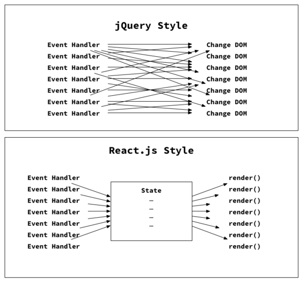

# React和jQuery的对比
> RAQ

## 引言
> 来源于阿里一面，项目中提到重构 jQuery 组件成 React

1. React 并不适合所有项目，需要结合实际情况综合考虑
2. jQuery 与 React 并不是一个层面上的东西。React 是一个用于构建用户界面的JavaScript 库,也是 Web 应用程序的视图层，jQuery 只是一个工具库，这里只是展示两种编程模式的思维差异
3. 理解一个技术的思想比学会怎么用它更重要，同时我们还需要知道不同的技术间的区别的核心在哪，这样我们才能学会用合适的技术去解决合适的问题
4. 这里的 tweet box 只是一个简化版的 UI 模型，仅用来说明 jQuery 和 React 的思维差异，并不具备发 Twitter 的功能
5. 你也可以写出简洁的 jQuery 代码。但是你必须想出良好的代码结构，每次想要增加新功能的时候还需要特别注意是否影响代码的重构，使用 React 会帮助你团队内部拥有更好的代码结构，页面性能也会得到相应的提高

## 项目效果
* tweet box为空时，tweet button显示为灰色不可点击状态
* tweet box下方显示还可以输入的字符数量
* 点击add photo，剩余字符数量及add photo按钮状态发生改变（假定图片占用23个字符）

## React 版本
> React.js 提供了一整套 Virtual DOM，所有的操作都在这个 Virtual DOM 上，只有当事件发生的时候，state 才发生改变，之后，React 自动调用 render() 来更新UI

[React版本演示代码](http://jsbin.com/verazi/5/edit?html,js,output)
### React代码处理问题的思路：
1. 创建一个状态变量用来追踪textarea中的字符的数量
2. 在textarea的onChange事件发生时改变其状态
3. 使用render()重新渲染tweet box，显示还可以输入的字符的数量

```react
Class TweetBox {
  getInitialState() {
    return {
      text: "",
      photoAdded: false
    };
  },
  handleChange(event) {
    this.setState({ text: event.target.value });
  },
  togglePhoto(event) {
    this.setState({ photoAdded: !this.state.photoAdded });
  },
  remainingCharacters() {
    if (this.state.photoAdded) {
      return 140 - 23 - this.state.text.length;
    } else {
      return 140 - this.state.text.length;
    }
  },
  render() {
    return (
        <div className="well clearfix">
            <textarea className="form-control" onChange={this.handleChange}></textarea>
            <br/>
            <span>{ this.remainingCharacters() }</span>
            <button className="btn btn-primary pull-right"
                    disabled={this.state.text.length === 0 && !this.state.photoAdded}>
                Tweet
            </button>
            <button className="btn btn-default pull-right" onClick={this.togglePhoto}>
                {this.state.photoAdded ? "✓ Photo Added" : "Add Photo" }
            </button>
        </div>
    );
  }
};
 
React.render(
  <TweetBox />,
  document.body
);
```

## jQuery版本
> 因为jQuery只是一个工具库，它处理问题的思路是，用选择器选择DOM元素，有需要的话就对某个DOM元素进行监听，然后再事件监听函数里进行相对应的处理

[jQuery版演示代码](http://jsbin.com/geqisi/8/edit?html,js,output)
### jQuery处理问题的思路
1. 给按钮或者文本框绑定监听事件
2. 如果事件触发则开始判断，各个DOM对象的当前状态（通常会借助css class来表示状态）
3. 改变对应的DOM来实现想要达到的效果（tweet box下方显示还可以输入的字符数量，按钮是否可点击）

```html
<div class="well clearfix">
    <textarea class="form-control"></textarea><br>
    <span>140</span>
    <button class="js-tweet-button btn btn-primary pull-right" disabled>Tweet</button>
    <button class="js-add-photo-button btn btn-default pull-right">Add Photo</button>
</div>
```
```js
// 给文本框绑定事件，监听是否有输入
$("textarea").on("input", function() {
    if ($(".js-add-photo-button").hasClass("is-on")) {
        // add phtot按钮已经点击，剩余输入文本数量再减23
        $("span").text(140 - 23 - $(this).val().length);
    } else {
        // 计算剩余文本数量
        $("span").text(140 - $(this).val().length);
    }


    if ($(this).val().length > 0 || $(".js-add-photo-button").hasClass("is-on")) {
            // 如果文本框里有内容或者add phtot按钮已经点击，tweet button设置为可点击状态
        $(".js-tweet-button").prop("disabled", false);
    } else {
            // tweet button设置为不可点击状态
        $(".js-tweet-button").prop("disabled", true);
    }
});


// 给添加照片的按钮绑定点击事件监听
$(".js-add-photo-button").on("click", function() {
    if ($(this).hasClass("is-on")) {
        $(this).removeClass("is-on").text("Add Photo");  // 切换add photo按钮显示状态


        $("span").text(140 - $("textarea").val().length);
        if ($("textarea").val().length === 0) {
            // 切换tweet按钮前需要先判断textarea当前状态
            $(".js-tweet-button").prop("disabled", true);
        }
    } else {
        $(this).addClass("is-on").text("✓ Photo Added");  // 切换add photo按钮显示状态


        $("span").text(140 - 23 - $("textarea").val().length);
        $(".js-tweet-button").prop("disabled", false);
    }
});
```
## 总结
### React 的优点
* 虚拟节点。在 UI 方面，不需要立刻更新视图，而是生成虚拟 DOM 后统一渲染。
* 组件机制。各个组件独立管理,层层嵌套，互不影响，react 内部实现的渲染功能。
* 差异算法。根据基本元素的 key 值，判断是否递归更新子节点，还是删除旧节点，添加新节点。



1. 在React中，只有当事件发生的时候，state才发生改变，之后，React自动调用render()来更新UI，**state成为了事件以及render()之间过渡**：
  * 每个事件不需要担心哪一部分的DOM发生变化，他们只需要设置state就可以了
  * 相应的，当你写render()的时候，你也只需要担心现在的state是什么
2. jQuery没有中间的过渡层'state'，我们需要花费很大的精力来解决它们之间相互的联系(对于复杂的组件，建议使用React而不是jQuery)
3. React中把各个UI组件独立出来，有利于提高UI组件的复用率同时降低各个UI组件的耦合
4. 新手在直接操作DOM时很难写出高效而又优雅的代码，从而使得前端代码满满变得越来越难以维护

* 也就是说，React适合用在那些DOM操作复杂的单页面应用，有利于提高代码可读性以及提高页面性能（可以参考React Diff算法）；
* jQuery则是个用来帮你完成一些基本操作的工具库
## 文章来源
[为什么是React－浅谈React与jQuery的思维差异](https://blog.csdn.net/uwenhao2008/article/details/79557969)
