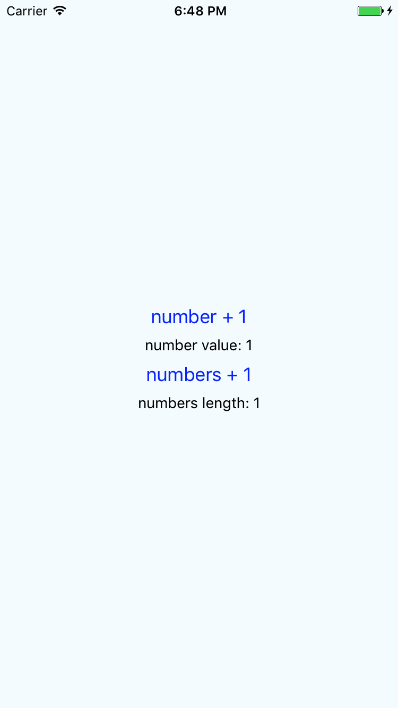

# React性能优化方案之PureComponent

## 介绍
PureRenderMixin，是对react的shouldComponentUpdate的方法进行重写去优化。但自从React15.3中新加了一个 PureComponent 类，易于在自己的组件使用，只需要将Component 换成 PureComponent 即可。

## PureComponent原理
当props或者state改变的时候，会执行shouldComponentUpdate方法来判断是否需要重新render组建，我们平时在做页面的性能优化的时候，往往也是通过这一步来判断的。Component默认的shouldComponentUpdate返回的是true，如下：
```js
shouldComponentUpdate(nextProps, nextState) {
  return true;
}
```

而PureComponent的shouldComponentUpdate是这样的：

```js
if (this._compositeType === CompositeTypes.PureClass) {
  shouldUpdate = !shallowEqual(prevProps, nextProps) || ! shallowEqual(inst.state, nextState);
}
```
这里的比较，只会做浅比较，即**比较两者的内存地址是否相同，而对于其值是否发生变化，则不会理会**。

```js
/**
 * Sample React Native App
 * https://github.com/facebook/react-native
 * @flow
 */

import React, { PureComponent,Component } from 'react';
import {
  AppRegistry,
  StyleSheet,
  Text,
  View,
  Button
} from 'react-native';

export default class test extends PureComponent {
  constructor(props){
    super(props);
    this.state = {
       number : 1,
       numbers: [],
    };
  }

  render() {
    return (
      <View style={styles.container}>
        <Button title={'number + 1'} onPress={this.numberAdd.bind(this)} />
        <Text>number value: {this.state.number}</Text>
        <Button title={'numbers + 1'} onPress={this.numbersAdd.bind(this)} />
        <Text>numbers length: {this.state.numbers.length}</Text>
      </View>
    );
  }

  numberAdd(){
      this.setState({number: ++this.state.number });
  }


  numbersAdd(){
    let numbers = this.state.numbers;
    numbers.push(1);
    this.setState({numbers: numbers});
    console.log(this.state.numbers);
  }


}

const styles = StyleSheet.create({
  container: {
    flex: 1,
    justifyContent: 'center',
    alignItems: 'center',
    backgroundColor: '#F5FCFF',
  },
  welcome: {
    fontSize: 20,
    textAlign: 'center',
    margin: 10,
  },
  instructions: {
    textAlign: 'center',
    color: '#333333',
    marginBottom: 5,
  },
});

AppRegistry.registerComponent('test', () => test);
```



这里去点击number+1 和 numbers+1都不会有任何页面的变化。

## 如何让PureComponent重绘
那如果PureComponent变化的时候(这其实不符合我们的初衷)，我们要怎么做呢？这里有两个办法：

1. 重写shouldUpdateComponent方法
2. props或者state增减参数

```js
numbersAdd(){
    let numbers = this.state.numbers;
    numbers.push(1);
    this.setState({numbers: numbers});
    console.log(this.state.numbers);

    this.setState({newState: 1});
  }
```
这样，shouldComponentUpdate的返回值也会是true。

综上，PureComponent非常适合于不变的组件，尤其是和数据、业务无关的纯展示组件，因为它的节省了大量比较的工作。但是对于大部分的业务来说，界面很少会有不变的组件，所以使用的场景会比较少，但是如果遇到，请尽情使用！


## 文章来源
* [何时使用Component还是PureComponent？](https://segmentfault.com/a/1190000014979065)