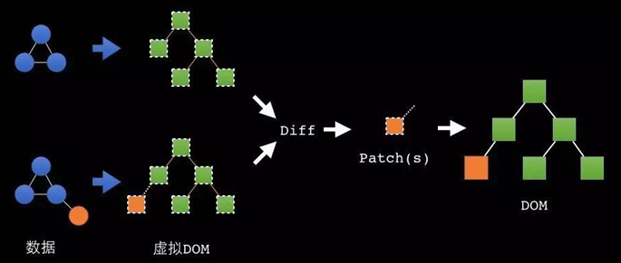
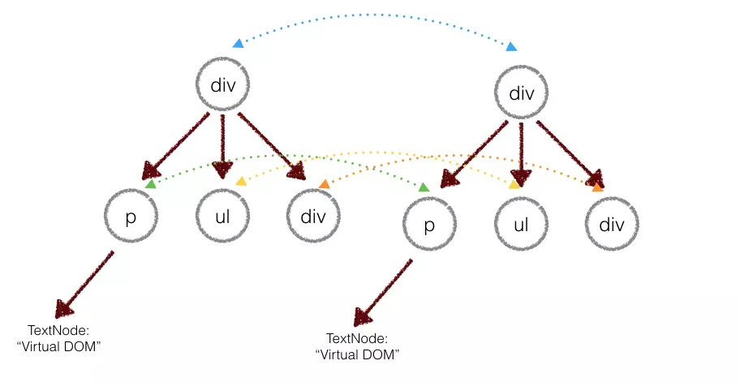
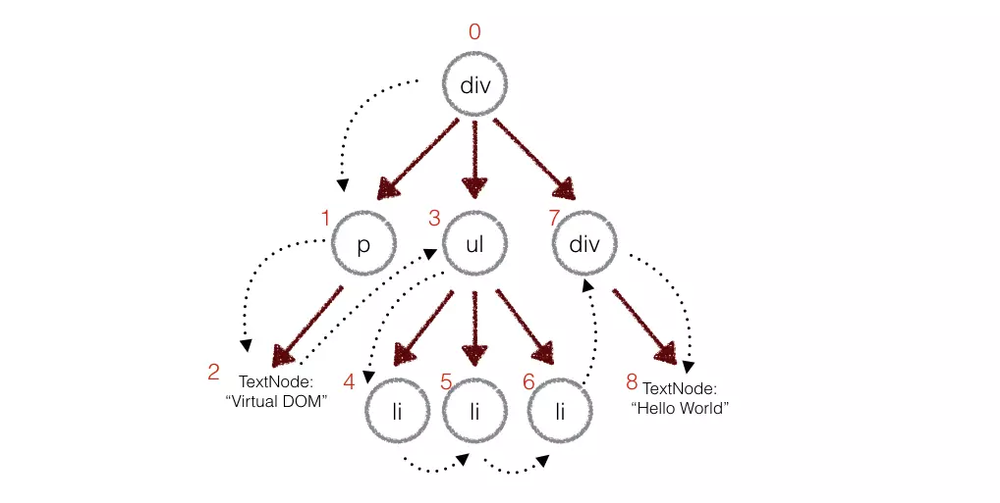

# React是如何工作的

## Virtual Dom VS Browser Dom
React 除了是 MVC 框架，**数据驱动**页面的特点之外，核心的就是他很"快"。 按照普遍的说法："因为直接操作 DOM 会带来重绘、回流等，带来巨大的性能损耗而导致渲染慢等问题。React使用了 Virtual DOM，每次状态更新，React 比较 Virtual DOM的差异之后，再更改变化的内容，最后统一由 React 去修改真实 DOM、完成页面的更新、渲染。"

> 什么是 Virtual DOM，React 是怎么进行比较的？Diff 算法了解吗？

* Virtual DOM 是 React 的核心，它的本质是 JavaScript 对象；
* BrowserDOM（也就是页面真实 DOM）就是 Browser 对象了。

Virtual DOM 的特点
1. 本质是 JS 对象，代表着真实的 DOM
2. 比真实 DOM 的比较和操作快的多
3. 每秒可创建 200,000 个 Virtual DOM 节点
4. 每次 setState 或 despatch 一个 action，都会创建一次全新的 Virtual dom

每一个改动，每一个动作都会让React去根据当前的状态创建一个全新的Virtual DOM。

**在 React 中，render 执行的结果得到的并不是真正的 DOM 节点，而仅仅是 JavaScript 对象，称之为虚拟 DOM**。

React 会在内存中维护一个虚拟 DOM 树，对这个树进行读或写，实际上是对虚拟DOM 进行读写。当数据变化时，React 会自动更新虚拟 DOM，然后将新的虚拟 DOM 和旧的虚拟 DOM 进行对比，找到变更的部分，得出一个 diff，然后将 diff 放到一个**队列**里，最终**批量更新**这些 diff 到 DOM 中。



## Diff算法
React 会抓取每个状态下的内容，生成一个全新的 Virtual DOM，然后通过和前一个的比较，找出不同和差异。React 的 Diff 算法有两个约定：
1. 两个不同类型的元素，会产生两个不同的树
2. 对于同一层次的一组子节点，它们可以通过唯一的id进行区分

> 为什么React中列表模板中要加入key

比如真实DOM的ul标签下，有一系列的<li>标签，然而当你想要重新排列这个标签时，如果你给了每个标签一个key值，React在比较差异的时候，就能够知道"你还是你，只不过位置变化了"。 **React除了要最快的找到差异外，还希望变化是最小的**。**如果加了key，react就会保留实例，而不像之前一样，完全创造一个全新的DOM**。

## Diff运算实例
### 不同类型的dom元素
### 同类型dom元素
### 相同类型的组件元素
与上面类似，相同类型的组件元素，子元素的实力会保持，不会摧毁。 当组件更新时，实例保持不变，以便在渲染之间保持状态。**React更新底层组件实例的props以匹配新元素，并在底层实例上调用componentWillReceiveProps（）和componentWillUpdate（）**。

接下来，调用render()方法，diff算法对前一个结果和新结果进行递归

### key props
* 场景一：在一个列表最后增加一个元素
```
<ul>
  <li>first</li>
  <li>second</li>
</ul>
------
<ul>
  <li>first</li>
  <li>second</li>
  <li>third</li>
</ul>
```
可以看到，在这种情况下，React只需要在最后insert一个新元素即可，其他的都不需要变化，这个时候React是高效的。                           

* 场景二：在列表最前面插入一个元素
```
<ul>
  <li>Duke</li>
  <li>Villanova</li>
</ul>
---
<ul>
  <li>Connecticut</li>
  <li>Duke</li>
  <li>Villanova</li>
</ul>
```
这对React可能就是灾难性的，因为React只知道前两个元素不同，因此会完全创新一个新的元素，最后导致三个元素都是重新创建的，这大大降低了效率。这个时候，key就排上用场了。当子元素有key时，**React使用key将原始树中的子元素与后续树中的子元素相匹配**。例如，在上面的低效示例中添加一个key可以使树转换更高效：
```
<ul>
  <li key="2015">Duke</li>
  <li key="2016">Villanova</li>
</ul>
------
<ul>
  <li key="2014">Connecticut</li>
  <li key="2015">Duke</li>
  <li key="2016">Villanova</li>
</ul>
```
这样，只有key值为2014的是新创建的，而2015和2016仅仅是移动了位置而已。

### 策略
两个树的完全的 diff 算法是一个时间复杂度为 O(n^3) 的问题。但是在前端当中，你很少会跨越层级地移动DOM元素。所以 Virtual DOM 只会对同一个层级的元素进行对比：



上面的div只会和同一层级的div对比，第二层级的只会跟第二层级对比。这样算法复杂度就可以达到 O(n)。

### 深度优先遍历
在实际代码中，会对新旧两棵树进行一个深度优先的遍历，这样每个节点都会有一个唯一的标记，然后记录差异



比如第上图中的1号节点p，有了变化，这样子就记录如下：
```
patches[1] = [{difference}, {difference}...]//用数组存储新旧节点的差异
```