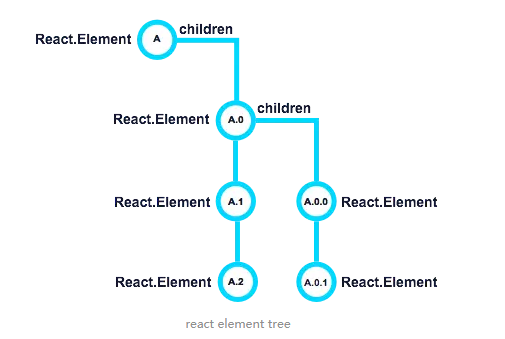

# React 生命周期
React 生命周期分为三种状态 1. 初始化 2.更新 3.销毁


## 初始化
1. getDefaultProps()

设置默认的props，也可以用dufaultProps设置组件的默认属性.

2. getInitialState()

在使用es6的class语法时是没有这个钩子函数的，可以直接在constructor中定义this.state。此时可以访问this.props

3. componentWillMount()

componentWillMount函数在第一次render之前被调用，并且只会被调用一次。当组件进入到这个生命周期中时，所有的state和props已经配置完毕，我们可以通过this.props和this.state访问它们，也可以通过setState重新设置状态。总之推荐在这个生命周期函数里进行状态初始化的处理，为下一步render做准

4. render()

react最重要的步骤，创建虚拟dom，进行diff算法，更新dom树都在此进行。此时就不能更改state了。
* 不要尝试在render里改变组件的状态。因为通过setState引发的状态改变会导致再一次调用render函数进行渲染，而又继续改变状态又继续渲染，导致无限循环下去。
* 不应该在render中通过ReactDOM.findDOMNode方法访问原生的DOM元素（原生相对于虚拟DOM而言）。因为这么做存在两个风险：1、此时虚拟元素还没有被渲染到页面上，所以你访问的元素并不存在。2、因为当前的render即将执行完毕返回新的DOM结构，你访问到的可能是旧的数据。

5. componentDidMount()

当这个函数被调用时，就意味着可以访问组件的原生DOM了。如果你有经验的话，此时不仅仅能够访问当前组件的DOM，还能够访问当前组件孩子组件的原生DOM元素。



在出生阶段时componentWillMount和render的调用顺序是
```
A -> A.0 -> A.0.0 -> A.0.1 -> A.1 -> A.2.
```
这很容易理解，因为当你想渲染父组件时，务必也要立即开始渲染子组件。所以子组件的生命周期开始于父组件之后。

而componentDidMount的调用顺序是
```
 A.2 -> A.1 -> A.0.1 -> A.0.0 -> A.0 -> A
```
componentDidMount的调用顺序正好是render的反向。这其实也很好理解。如果父组件想要渲染完毕，那么首先它的子组件需要提前渲染完毕，也所以子组件的componentDidMount在父组件之前调用。

因为能够访问原生DOM的缘故，你可能会在componentDidMount函数中重新对元素的样式进行计算，调整然后生效。因此立即需要对DOM进行重新渲染，此时会使用到forceUpdate方法

## 更新
更新阶段会在三种情况下触发：
* 更改props：一个组件并不能主动更改它拥有的props属性，它的props属性是由它的父组件传递给它的。强制对props进行重新赋值会导致程序报错。
* 更改state：state的更改是通过setState接口实现的。同时设计state是需要技巧的，哪些状态可以放在里面，哪些不可以；什么样的组件可以有state，哪些不可以有；这些都需要遵循一定原则的。这个话题有机会可以单独拎出来说
* 调用forceUpdate方法：这个我们在上一阶段已经提到了，强制组件进行更新。


6. **componentWillReceiveProps**(nextProps)

组件初始化时不调用，组件接受新的props时调用。

当传递给组件的props发生改变时，组件的componentWillReceiveProps即会被触发调用，方法传递的参数的是发生更改的之后的props值（通常我们命名为**nextProps**）。在这个方法里，你可以通过this.props访问当前的属性值，可以通过nextProps访问即将更新的属性值，或者将它们进行对比，或者将它们进行计算，最终确定你需要更新的状态（state）并最终调用setState方法对状态进行更新。**在这个钩子函数中调用setState方法并不会触发再一次渲染**。

非常有意思的是，虽然props的更改会引起componentWillReceiveProps的调用；但componentWillReceiveProps的调用并不意味着props真的发生了变化。
```js
class App extends React.Component {
  constructor(props) {
    super(props);
    this.state = {
      number: 1,
    }
    this.onClick = this.onClick.bind(this);
  }
  onClick() {
    this.setState({
      number: 1,
    })
  }
  render() {
    return (
      <MyButton onClick={this.onClick} data-number={this.state.number} />
    );
  }
}
```
每一次点击事件都会重新使用setState接口对state进行更新，但每次更新的值都是相同的，即number:1。并且把当前组件的状态以属性的形式传递给<MyButton />。问题来了，那么当我每次点击按钮时，按钮MyButton的componentWillReceiveProps都会被调用吗？

会，即使每次更新的值都是一样的。

之所以出现这样的情况原因其实非常简单，因为React并不知道传入的属性是否发生了更改。而为什么React不尝试去做一个是否相等的判断呢？

因为办不到，新传入的属性和旧属性可能引用的是同一块内存区域（引用类型），所以单纯的用===判断是否相等并不准确。可行的解决办法之一就是对数据进行深度拷贝然后进行比较，但是这对大型数据结构来说性能太差，还能会碰上循环引用的问题。

所以React将这个变化通过钩子函数暴露出来，**千万不要以为当componentWillReceiveProps被调用就意味着props发生了更改，如果需要在变化时做一些事情，务必要手动的进行比较**。

7. **shouldComponentUpdate**(nextProps, nextState)

react性能优化非常重要的一环。组件接受新的state或者props时调用，我们**可以设置在此对比前后两个props和state是否相同，如果相同则返回false阻止更新**，因为相同的属性状态一定会生成相同的dom树，这样就不需要创造新的dom树和旧的dom树进行diff算法对比，节省大量性能，尤其是在dom结构复杂的时候

传递给shouldComponentUpdate的参数包括即将改变的props和state，形参的名称是nextProps和nextState，在这个函数里你同时又能通过this关键字访问到当前的state和props，所以你在这里你是“全知”的，**可以完全按照你自己的业务逻辑判断是否state与props是否发生了更改，并且决定是否要继续接下来的步骤**。shouldComponentUpdate也就通常我们在优化React性能时的第一步。这一步的优化不仅仅是优化组件自身的流程，同时也能节省去子组件的重新渲染的代价

8. componentWillUpdata(nextProps, nextState)

componentWillUpdate方法和componentWillMount方法很相似，都是在即将发生渲染前触发，在这里你能够拿到nextProps和nextState，同时也能访问到当前即将过期的props和state。如果有需要的话你可以把它们暂存起来便于以后使用。

与componentWillMount不同的是，在这个方法中你不可以使用setState，否则会立即触发另一轮的渲染并且又再一次调用componentWillUpdate，陷入无限循环中。

9. render()

组件渲染

10. componentDidUpdate()

组件初始化时不调用，组件更新完成后调用，此时可以获取dom节点。

因为可以访问DOM的缘故，我们有可能需要在这个钩子函数里获取实际的元素样式，并且写入state中，比如你的代码可能会长这样：
```
componentDidUpdate(prevProps, prevState) {
// BAD: DO NOT DO THIS!!!
  let height = ReactDOM.findDOMNode(this).offsetHeight;
  this.setState({ internalHeight: height });
}
```
如果默认情况下你的shouldComponentUpdate()函数总是返回true的话，那么这样在componentDidUpdate里更新state的代码又会把我们带入无限render的循环中。如果你必须要这么做，那么至少应该把上一次的结果缓存起来，有条件的更新state:
```
componentDidUpdate(prevProps, prevState) {
  // One possible fix...
  let height = ReactDOM.findDOMNode(this).offsetHeight;
  if (this.state.height !== height ) {
    this.setState({ internalHeight: height });
  }
}
```
## 卸载
11. componentWillUnmount()

1. 将已经发送的网络请求都取消掉
2. 移除组件上DOM的Event Listener

## 文章来源
* [深入React的生命周期(上)：出生阶段(Mount)](https://juejin.im/post/59fede45f265da430b7a9d9f)
* [深入React的生命周期(下)：更新(Update)](https://juejin.im/post/5a0852325188255ea95b6f26)