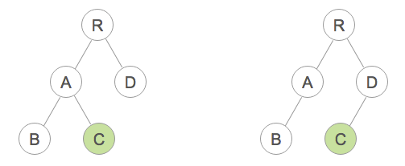

# Virtual Dom Diff 算法解析
> VDD

* [Virtual Dom Diff 算法](#VirtualDomDiff算法)
* [不同节点类型的比较](#不同节点类型的比较)
  * [逐层进行节点比较](#逐层进行节点比较)
  * [由DOMDiff算法理解组件的生命周期](#由DOMDiff算法理解组件的生命周期)
* [相同类型节点的比较](#相同类型节点的比较)
* [列表节点的比较](#列表节点的比较)
* [总结](#总结)

## Virtual Dom Diff 算法
标准的的Diff算法复杂度需要 O(n^3)，Diff算法复杂度直接降低到 O(n)

React 中最值得称道的部分莫过于 Virtual DOM 与 diff 的完美结合，特别是其高效的 diff 算法，让用户可以无需顾忌性能问题而”任性自由”的刷新页面，让开发者也可以无需关心 Virtual DOM 背后的运作原理，因为 React diff 会帮助我们计算出 Virtual DOM 中真正变化的部分，并只针对该部分进行实际 DOM 操作，而非重新渲染整个页面，从而保证了每次操作更新后页面的高效渲染，因此 Virtual DOM 与 diff 是保证 React 性能口碑的幕后推手。

1. **Web UI 中 DOM 节点跨层级的移动操作特别少，可以忽略不计**。
2. **两个相同组件产生类似的 DOM 结构，不同的组件产生不同的 DOM 结构**；
3. **对于同一层次的一组子节点，它们可以通过唯一的id进行区分**。

* tree diff：即对树进行分层比较，两棵树只会对同一层次的节点进行比较。
* component diff
  * 如果是同一类型的组件，按照原策略继续比较 virtual DOM tree。
  * 如果不是，则将该组件判断为 dirty component，从而替换整个组件下的所有子节点。
  * 对于同一类型的组件，有可能其 Virtual DOM 没有任何变化，如果能够确切的知道这点那可以节省大量的 diff 运算时间，因此 React 允许用户通过 shouldComponentUpdate() 来判断该组件是否需要进行 diff。
* element diff
  * 当节点处于同一层级时，React diff 提供了三种节点操作，分别为：INSERT_MARKUP（插入）、MOVE_EXISTING（移动）和 REMOVE_NODE（删除）。
  * INSERT_MARKUP，新的 component 类型不在老集合里， 即是全新的节点，需要对新节点执行插入操作。
  * MOVE_EXISTING，在老集合有新 component 类型，且 element 是可更新的类型，generateComponentChildren 已调用 receiveComponent，这种情况下 prevChild=nextChild，就需要做移动操作，可以复用以前的 DOM 节点。
  * REMOVE_NODE，老 component 类型，在新集合里也有，但对应的 element 不同则不能直接复用和更新，需要执行删除操作，或者老 component 不在新集合里的，也需要执行删除操作。


## 不同节点类型的比较
在React中即比较两个虚拟DOM节点，当两个节点不同时，应该如何处理。这分为两种情况：
（1）节点类型不同   
（2）节点类型相同，但是属性不同。  

### 节点类型不同
当在树中的同一位置前后输出了不同类型的节点，React直接删除前面的节点，然后创建并插入新的节点。

假设我们在树的同一位置前后两次输出不同类型的节点。
```
renderA: <div />
renderB: <span />
=> [removeNode <div />], [insertNode <span />]
```

需要注意的是，删除节点意味着彻底销毁该节点，而不是再后续的比较中再去看是否有另外一个节点等同于该删除的节点。**如果该删除的节点之下有子节点，那么这些子节点也会被完全删除，它们也不会用于后面的比较。这也是算法复杂能够降低到O（n）的原因**。

上面提到的是对虚拟DOM节点的操作，而同样的逻辑也被用在React组件的比较，例如：
```
renderA: <Header />
renderB: <Content />
=> [removeNode <Header />], [insertNode <Content />]
```
当React在同一个位置遇到不同的组件时，也是简单的销毁第一个组件，而把新创建的组件加上去。这正是应用了第一个假设，**不同的组件一般会产生不一样的DOM结构，与其浪费时间去比较它们基本上不会等价的DOM结构，还不如完全创建一个新的组件加上去**。

### 逐层进行节点比较
在React中，树的算法其实非常简单，那就是两棵树只会对同一层次的节点进行比较。


React只会对相同颜色方框内的DOM节点进行比较，即同一个父节点下的所有子节点。**当发现节点已经不存在，则该节点及其子节点会被完全删除掉，不会用于进一步的比较**。这样**只需要对树进行一次遍历**，便能完成整个DOM树的比较。

例如，考虑有下面的DOM结构转换：


A节点被整个移动到D节点下，直观的考虑DOM Diff操作应该是
```
A.parent.remove(A); 
D.append(A);
```
但因为React只会简单的考虑同层节点的位置变换，**对于不同层的节点，只有简单的创建和删除**。当根节点发现子节点中A不见了，就会直接销毁A；而当D发现自己多了一个子节点A，则会创建一个新的A作为子节点。因此对于这种结构的转变的实际操作是：
```
A.destroy();
A = new A();
A.append(new B());
A.append(new C());
D.append(A);
```
可以看到，**以A为根节点的树被整个重新创建**。

虽然看上去这样的算法有些“简陋”，但是其基于的是第一个假设：**两个不同组件一般产生不一样的DOM结构**。根据React官方博客，这一假设至今为止没有导致严重的性能问题。这当然也给我们一个提示，在实现自己的组件时，**保持稳定的DOM结构会有助于性能的提升**。例如，**我们有时可以通过CSS隐藏或显示某些节点，而不是真的移除或添加DOM节点**。

### 由DOMDiff算法理解组件的生命周期


* constructor: 构造函数，组件被创建时执行；
* componentDidMount: 当组件添加到DOM树之后执行；
* componentWillUnmount: 当组件从DOM树中移除之后执行，在React中可以认为组件被销毁；
* componentDidUpdate: 当组件更新时执行。

[示例](https://supnate.github.io/react-dom-diff/index.html)



```
C will unmount.
C is created.
B is updated.
A is updated.
C did mount.
D is updated.
R is updated.
```
可以看到，C节点是完全重建后再添加到D节点之下，而不是将其“移动”过去。

### 相同类型节点的比较
第二种节点的比较是相同类型的节点，算法就相对简单而容易理解。React会对属性进行重设从而实现节点的转换。例如：
```
renderA: <div id="before" />
renderB: <div id="after" />
=> [replaceAttribute id "after"]
```
虚拟DOM的style属性稍有不同，其值并不是一个简单字符串而必须为一个对象，因此转换过程如下：
```
renderA: <div style={{color: 'red'}} />
renderB: <div style={{fontWeight: 'bold'}} />
=> [removeStyle color], [addStyle font-weight 'bold']
```

## 列表节点的比较
上面介绍了**对于不在同一层的节点的比较，即使它们完全一样，也会销毁并重新创建**。那么当它们在同一层时，又是如何处理的呢？这就涉及到列表节点的Diff算法。相信很多使用React的同学大多遇到过这样的警告：


这是 React 在遇到列表时却又找不到 key 时提示的警告。虽然无视这条警告大部分界面也会正确工作，但这通常意味着潜在的性能问题。因为 React 觉得自己可能无法高效的去更新这个列表。

列表节点的操作通常包括添加、删除和排序。例如下图，我们需要往 B 和 C 直接插入节点 F，在 jQuery 中我们可能会直接使用 $(B).after(F) 来实现。而在 React 中，我们只会告诉 React 新的界面应该是 A-B-F-C-D-E，由 Diff 算法完成更新界面。


这时如果每个节点都没有唯一的标识，React无法识别每一个节点，那么更新过程会很低效，即，将C更新成F，D更新成C，E更新成D，最后再插入一个E节点。效果如下图所示：


可以看到，React会逐个对节点进行更新，转换到目标节点。而最后插入新的节点E，涉及到的DOM操作非常多。而如果给每个节点唯一的标识（key），那么React能够找到正确的位置去插入新的节点，如下图所示：


对于列表节点顺序的调整其实也类似于插入或删除，[示例](https://supnate.github.io/react-dom-diff/index.html)将树的形态从shape5转换到shape6：


即将同一层的节点位置进行调整。如果未提供key，那么React认为B和C之后的对应位置组件类型不同，因此完全删除后重建，控制台输出如下：
```
B will unmount.
C will unmount.
C is created.
B is created.
C did mount.
B did mount.
A is updated.
R is updated.
```
而如果提供了key，如下面的代码：
```JS
shape5: function() {
  return (
    <Root>
      <A>
        <B key="B" />
        <C key="C" />
      </A>
    </Root>
  );
},

shape6: function() {
  return (
    <Root>
      <A>
        <C key="C" />
        <B key="B" />
      </A>
    </Root>
  );
},
```
那么控制台输出如下：
```
C is updated.
B is updated.
A is updated.
R is updated.
```
可以看到，对于列表节点提供唯一的key属性可以帮助React定位到正确的节点进行比较，从而大幅减少DOM操作次数，提高了性能。

## 总结
本文分析了React的DOM Diff算法究竟是如何工作的，其复杂度控制在了O（n），这让我们考虑UI时可以完全基于状态来每次render整个界面而无需担心性能问题，简化了UI开发的复杂度。而算法优化的基础是文章开头提到的两个假设，以及React的UI基于组件这样的一个机制。理解虚拟DOM Diff算法不仅能够帮助我们理解组件的生命周期，而且也对我们实现自定义组件时如何进一步优化性能具有指导意义。

diff 算法：


传统 diff 算法：


React diff 算法：


## 文章来源
* [深入浅出React（四）：虚拟DOM Diff算法解析](http://www.infoq.com/cn/articles/react-dom-diff)
* [React 源码剖析系列 － 不可思议的 react diff](https://zhuanlan.zhihu.com/p/20346379?refer=purerender)
* [深入理解react（源码分析）](https://github.com/lanjingling0510/blog/issues/1#title2)