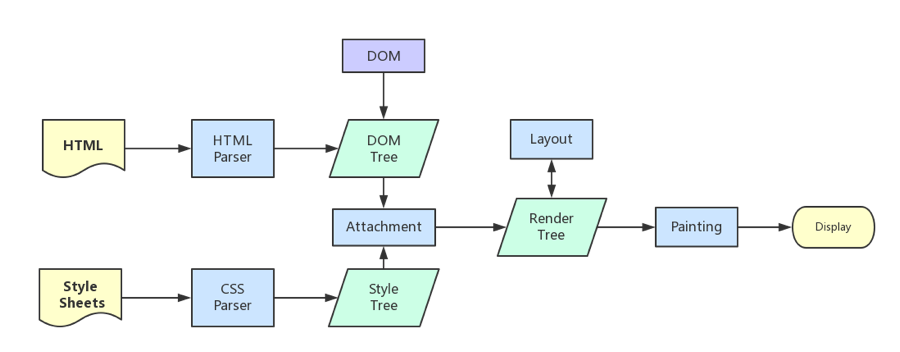

# 渲染机制
> render

## 渲染流程
1. 处理 HTML 并构建 DOM (Document Object Model)树。
2. 处理 CSS 构建 CSSOM (CSS Object Model)树。
3. 将 DOM 与 CSSOM 合并成一个渲染树。
4. 根据渲染树来布局，计算每个节点的位置。
5. 调用 GPU 绘制，合成图层，显示在屏幕上。



**在构建 CSSOM 树时，会阻塞渲染**，直至 CSSOM 树构建完成。并且构建 CSSOM 树是一个十分消耗性能的过程，所以应该尽量保证层级扁平，减少过度层叠，越是具体的 CSS 选择器，执行速度越慢。

* 当 HTML 解析到 script 标签时，会暂停构建 DOM，完成后才会从暂停的地方重新开始
* CSS 也会暂停构建 DOM

## Load 和 DOMContentLoaded 区别
* Load 事件触发代表页面中的 DOM，CSS，JS，图片已经全部加载完毕。

* DOMContentLoaded 事件触发代表初始的 HTML 被完全加载和解析，不需要等待 CSS，JS，图片加载

## 图层
一般来说，可以把普通文档流看成一个图层。特定的属性可以生成一个新的图层。不同的图层渲染互不影响，所以**对于某些频繁需要渲染的建议单独生成一个新图层**，提高性能。但也不能生成过多的图层，会引起反作用。

通过以下几个常用属性可以生成新图层
* 3D 变换：translate3d、translateZ
* will-change
* video、iframe 标签
* 通过动画实现的 opacity 动画转换
* position: fixed

## 重绘（Repaint）和重排（Reflow）
浏览器下载完页面所有组件——HTML标记、JavaScript、CSS、图片——之后会解析并生成两个内部数据结构

DOM树：表示页面结构

渲染树：表示DOM节点如何显示

重绘（repaint）：完成重排后，浏览器会重新绘制受影响的部分到屏幕中。

重排（reflow）：当DOM的变化影响了元素的几何属性（宽和高）——比如改变边框宽度或给段落增加文字，导致行数增加——浏览器需要重新计算元素的几何属性，同样其他元素的几何属性和位置也会因此受到影响。浏览器会使渲染树中受到影响的部分失效，并**重新构建渲染树**。

### 重排何时发生
* 添加或删除可见的DOM元素
* 元素位置改变
* 元素尺寸改变（外边距、内边距、边框厚度、宽度、高度）
* 内容改变
* 页面渲染器初始化
* 浏览器窗口尺寸改变

滚动条出现时触发整个页面的重排

### 渲染树变化的排队与刷新
由于每次重排都会产生计算消耗。大多数浏览器通过**队列化修改**并**批量执行**来优化重排过程。而获取布局信息的操作会导致队列刷新

* offsetTop、offsetLeft、offsetWidth、offsetHeight
* scrollTop、scrollLeft、scrollWidth、scrollHeight
* clientTop、clientLeft、clientWidth、clientHeight
* getComoutedStyle() (currentStyle in IE)

## 最小化重绘和重排
> 减少重绘和重排发生次数，应该合并多次对DOM和样式的修改，然后一次处理掉

### 1.改变样式
* element.style.cssText = "...";
* 修改CSS的class名称

### 2.批量修改DOM
使元素脱离文档流—>对其应用多重改变—>把元素带回文档中

上述过程会触发两次重排在步骤一和步骤三，如果忽略这两个步骤，那么第二步骤产生的任何改变都会引起重排

脱离文档流方法：
```
<ul id = "mylist">
  <li><a href="http://a.com">a</a></li>
  <li><a href="http://b.com">b</a></li>
</ul>
```
```js
var data = {
  { 
    name:"c",
    url:"http://c.com"
  },{
    name:"d",
    url:"http://d.com"
  }
};
```
```js
function appendDataElement(appendToElement,data){
  var a,li;
  for(var i=0,max=data.length;i<max;i++){
    a = document.createElement('a');
    a.href = data[i].url;
    a.appendChild(document.createTextNode(data[i].name));
    li = document.createElement('li');
    li.appendChild(a);
    appendToElement.appendChild(li);
  }
};
```
* 隐藏元素、应用修改、重新显示
```
var ul = document.getElementById('mylist');
ul.style.display = 'none';
appendDataElement(ul,data);
ul.style.display = 'block';
```
* 使用文档片段在当前DOM之外构建一个子树，再把它拷贝回文档(推荐)
```
var fragment = document.createDocumentFragment();
appendDataElement(fragment,data);
document.getElementById('mylist').appendChild(fragment);
```
* 将原始元素拷贝到一个脱离文档的节点中，修改副本，完成后再替换原始元素
```
var old = document.getElementById('mylist');
var clone = old.cloneNode(true);
appendDataToElement(clone,data);
old.parentNode,replaceChild(clone,old);
```
### 3.让元素脱离动画流
针对展开/折叠的方式来显示和隐藏部分页面这种模式，它包括展开区域的几何动画，并将页面其他部分推向下方。

避免页面的大部分重排：

* 使用绝对位置定位页面上的动画元素，将其脱离文档流。
* 让元素动起来，当它扩大时，会临时覆盖部分页面。但这只是页面一个小区域的重绘过程，不会产生重排并重绘页面的大部分内容。
* 当动画结束时恢复定位，从而只会下移一次文档的其他元素

### 4.使用 visibility 替换 display: none ，因为前者只会引起重绘，后者会引发重排（改变了布局）
### 5.将频繁运行的动画变为图层，图层能够阻止该节点回流影响别的元素。比如对于 video 标签，浏览器会自动将该节点变为图层。