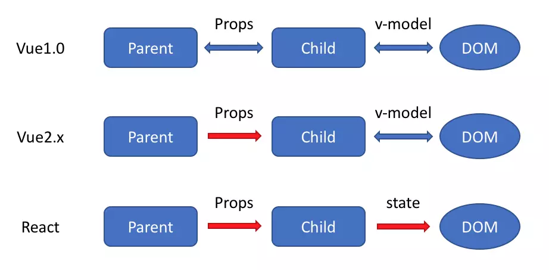
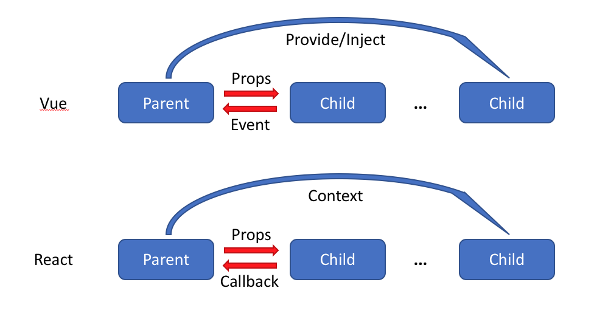

# 以react和vue为例，如何理解mvvm设计模式中的vm？
简单来说, 可以理解为 VM 是为了**声明数据与视图的对应关系**, **在 React 中对应其实就是 JSX 的部分**.

比如我现在有这样一个显示 count 的 React 应用, 下面这段代码相当于告诉 React :
> 我现在想渲染一段 html, 它的 innerHtml 就是this.props.count 的值


这其实就是 MVVM 中 VM 的部分.对于 PureComponent React Component 来说, 整个 React Component 其实也能算是一个 VM
```
const componentA = props =>(<div>{props.count}</div>)
```

VM 的关键点在于, 我们只是做了一个声明, 并没有直接地去修改 html. 我们只是修改了传入 React 组件的参数, 其余的同步状态的工作我们全部都交由 React 来帮我们处理


其实和字面意思一样, ViewModal, 我告诉 MVVM 框架渲染出来的视图大概长啥样, 它有什么输入, 有什么输出(回调), 框架干活输出 html 模板

---
# Vue和React的特性和写法上的区别

## 1、生命周期
* Vue


* React


## 2、入口和跟实例
* Vue

```vue
const app = new Vue({
  /* 选项 */
  render: (h) => h(App) // App为根组件
}).$mount('#app')
```

* React

```react
ReactDOM.render(
  <App/>, // App为根组件
  document.getElementById('app')
)
```

## 3、组件定义
* Vue

```vue
// 定义组件构造器
var MyComponent = Vue.extend({/* 选项 */})

// 注册全局组件
Vue.component('my-component', {/* 选项 */})
```
```vue
<!-- 单文件组件 -->
<template>
  <div class="my-component">hello</div>
</template>
<script>
  export default {
    /* 选项 */
  }
</script>
```

* React

```react
// 无状态组件
const Foo = () => {
  return <div className='foo'></div>
}
```
```react
// 完整组件
class Foo extends React.Component<{}, void> {
  render () {
    return <div className='foo'>hello</div>
  }
}
```

## 4、组件引用
* Vue

```vue
<!-- 以单文件组件为例：Foo.js -->
<template>
  <div class="Foo">
    <!-- kebab-case -->
    <bar></bar>
    <!-- 或 -->
    <Bar></Bar>
  </div>
</template>
<script>
  // 引入组件
  import Bar from './Bar'

  export default {
    name: 'Foo',
    components: {Bar}
  }
</script>
```

* React

```react
import Bar from './Bar'

class Foo extends React.Component<{}, void> {
  render () {
    return (
      <div className='foo'>
        {/* 组件约定大写开头*/}
        <Bar/>
      </div>
    )
  }
}
```

## 5、组件内部状态
* Vue
```vue
<template>
  <div class="foo">
    <p class='name'>{{name}}</p>
    <p class='age'>
      {{age}}
      <button @click="onAdd">add</button>
    </p>
  </div>
</template>
<script>
  export default {
    data () {
      return {
        name: 'Tom',
        age: 18
      }
    },
    methods {
      onAdd () {
        // 直接修改
        this.age++
      }
    }
  }
</script>
```	

* React

```react
interface IFooState {
  name: string,
  age: number
}

class Foo extends React.Component<{}, IFooState> {
  state = {
    name: 'tom',
    age: 18
  }

  onAdd = () => {
    // 必须通过setState修改
    this.setState({
      age: this.state.age + 1
    })
  }

  render () {
    const {name, age} = this.state

    return (
      <div className='foo'>
        <p class='name'>{name}</p>
        <p class='age'>
          {age}
          <button onClick={this.onAdd}>add</button>
        </p>
      </div>
    )
  }
}
```

## 6、父子组件通讯
* Vue

```vue
<!-- Parent.vue -->
<template>
  <div class="parent">
    <child name='tom' :age='18' @click="onAdd"></child>
  </div>
</template>
<script>
  export default {
    data () {
      return {
        age: 18
      }
    },
    methods {
      onAdd () {
        this.age++
      }
    }
  }
</script>
```
```vue
<!-- Child.vue -->
<template>
  <div class="child">
    <p class='name'>{{name}}</p>
    <p class='age'>
      {{age}}
      <button @click="onAdd">add</button>
    </p>
  </div>
</template>
<script>
  export default {
    props: {
      name: {type: String},
      age: {type: Number, default: 18}
    },
    methods {
      onAdd () {
        this.$emit('click')
      }
    }
  }
</script>
```

* React

```react
interface IChildProps {
  name: string,
  age?: number,
  onAdd?: () => void
}

class Child extends React.Component<IChildProps, void> {
  static defaultProps = {
    age = 18,
    onAdd: () => {}
  }

  render () {
    const {name, age} = this.props

    return (
      <div className='child'>
        <p class='name'>{name}</p>
        <p class='age'>
          {age}
          <button onClick={this.onAdd}>add</button>
        </p>
      </div>
    )
  }
}

interface IParentState {
  age: number
}

class Parent extends React.Component<{}, IParentState> {
  state = {
    age: 18
  }

  onAdd = () => {
    this.setState({
      age: this.state.age + 1
    })
  }

  render () {
    const {name, age} = this.state

    return (
      <div className='parent'>
        <Child name='Tom' age={18} onAdd={this.onAdd}></Child>
      </div>
    )
  }
}
```

## 7、模板和JSX语法
* Vue

```vue
<!-- 可搭配其他模板语言，如Pug等 -->
<template>
  <!-- 变量 -->
  <div>{{name}}</div>
  <!-- 表达式 -->
  <div>{{ ok ? 'YES' : 'NO' }}</div>
  <!-- HTML -->
  <div v-html="rawHtml"></div>
  <!-- 属性 -->
  <div id="app"></div>
  <div :id="dynamicId"></div>
  <foo :task-count="18"></foo>
  <foo :class="['item', foo]"></foo>
  <foo :style="{'margin-top': '10px'}"></foo>
  <!-- 事件 -->
  <foo @action="onAction"></foo>
</template>
```

* React

```react
render () {
  return (
    <!-- 变量 -->
    <div>{name}</div>
    <!-- 表达式 -->
    <div>{ ok ? 'YES' : 'NO' }</div>
    <!-- HTML -->
    <div dangerouslySetInnerHTML={rawHtml}></div>
    <!-- 属性 -->
    <div id='app'></div>
    <div id={dynamicId}></div>
    <foo taskCount={18}></foo>
    <foo className={'item ' + foo}></foo>
    <foo style={{marginTop: 10}}></foo>
    <!-- 事件 -->
    <foo onAction="onAction"></foo>
  )
}
```

## 8、条件渲染
* Vue

```vue
<template>
  <div v-if="foo">foo</div>
</template>

<template>
  <div v-if="foo">foo</div>
  <div v-else-if="bar">bar</div>
</template>

<template>
  <div v-if="foo">foo</div>
  <div v-else-if="bar">bar</div>
  <div v-else>other</div>
</template>
```

* React

```react
render () {
  return foo && <div>foo</div>
}

render () {
  return foo ? <div>foo</div> : <div>bar</div>
}

render () {
  return (
    { foo ? <div>foo</div>
      : bar
      ? <div>bar</div>
      : <div>other</div>
    }
  )
}
```

## 9、列表渲染
* Vue

```vue
<template>
  <div class='list'>
    <div v-for="item in list" :key="item">{{item}}</div>
  </div>
</template>
```
* React

```react
render () {
  return (
    <div className='list'>
      {list.map((item) => <div key={item}>{item}</div>)}
    </div>
  )
}
```
```react
// 或者
render () {
  const items = list.map((item) => <div key={item}>{item}</div>)

  return (
    <div className='list'>
      {items}
    </div>
  )
}
```

## 10、表单和双向绑定
* Vue

```vue
<!-- 表单 -->
<template>
  <form>
    <input v-model="name">
    <!--
      相当于以下的语法糖：
      <input v-bind:value="name" v-on:input="name = $event.target.value">
      在组件中相当于
      <foo v-bind:value="name" v-on:input="name = arguments[0]"></foo>
    -->
  </form>
</template>
<script>
  export default {
    data () {
      return {
        name: ''
      }
    }
  }
</script>
```
```vue
<!-- Vue 2.3.0+ -->

<!-- Parent.vue -->
<template>
  <child :foo.sync="bar"></child>
  <!--
    sync只是语法糖，实际上拓展为：
    <child :foo="bar" @update:foo="val => bar = val"></child>
  -->
</template>

<!-- Child.vue -->
<script>
  export default {
    methods: {
      onChange () {
        this.$emit('update:foo', newValue)
      }
    }
  }
</script>
```
* React

```react
interface IFooState {
  name: string
}

class Foo extends React.Component<{}, IFooState> {
  onChange = (e) => {
    const name = e.target.value
    this.setState({name})
  }

  render () {
    const {value} = this.state

    return (
      <div>
        <input value={value} onChange={this.onChange}/>
      </div>
    )
  }
}
```
## 11、内容分发

* Vue

```vue
<!-- Child -->
<template>
  <!-- 必须有根元素 -->
  <div class="child">
    <slot name="header"></slot>
    <slot></slot>
    <slot name="footer"></slot>
  </div>
</template>
<script>
  export default {}
</script>

<!-- Parent -->
<template>
  <div class="parent">
    <child>
      <p slot="header">header</p>
      <p>content</p>
      <p slot="footer">footer</p>
    </child>
  </div>
</template>
<script>
  import Child from './Child'
  export default {
    components: {Child}
  }
</script>
```
* React

```react
interface IChildProps {
  header?: React.Node,
  children?: React.Node,
  footer?: React.Node
}

class Child extends React.Component<IChildProps, void> {
  render () {
    const {header, children, footer} = this.props
    return (
      <div className='child'>
        {header}
        {children}
        {footer}
      </div>
    )
  }
}

class Parent extends React.Component<{}, void> {
  render () {
    return (
      <div className='parent'>
        <Child
          className='child'
          header='header'}
          footer={<p>footer</p>}>
          <p>content</p>
        </Child>
      </div>
    )
  }
}
```
---
# 你知道React和Vue的区别吗? 

## Virtual DOM
Vue.js(2.0版本)与React的其中最大一个相似之处，就是他们都使用了一种叫'Virtual DOM'的东西。所谓的Virtual DOM基本上说就是它名字的意思：虚拟DOM，DOM树的虚拟表现。

比如我们往p节点中新增了一个span节点，于是我们一个新的Virtual DOM对象会被创建。

然后新的Virtual DOM 和旧的Virtual DOM比较，通过diff算法，算出差异，然后这些差异就会被应用在真实的DOM上

* Vue 很“ 嚣张 ”，它宣称可以更快地计算出Virtual DOM的差异，这是由于它在渲染过程中，由于**vue会跟踪每一个组件的依赖收集**，通过setter / getter 以及一些函数的劫持，能够**精确地知道变化**，并在**编译过程标记了static静态节点**，在接下来新的Virtual DOM 并且和原来旧的 Virtual DOM进行比较时候，跳过static静态节点。所以**不需要重新渲染整个组件树**。

* React默认是通过**比较引用**的方式进行，**当某个组件的状态发生变化时，它会以该组件为根，重新渲染整个组件子树**。如果想避免不必要的子组件重新渲染，你需要在所有可能的地方使用**PureComponent**，或者**手动实现shouldComponentUpdate方法**。但是Vue中，你可以认定它是默认的优化。

为什么 React 不精确监听数据变化呢？这是因为 Vue 和 React 设计理念上的区别，Vue 使用的是可变数据，而React更强调数据的不可变。

## 构建工具
* React 采用 Create-React-App，Create-Reacr-App会逼迫你使用webpack和Babel
* Vue 采用的是Vue-Cli，可以按需创建不同的模板，使用起来更加灵活一点

## 数据流



* 在Vue2.x中，只能parent -> Child <-> DOM的形式，而React只能单向传递
* React一直提倡的是单向数据流，数据主要从父节点传递到子节点（通过props）。如果顶层（父级）的某个props改变了，React会重渲染所有的子节点。我们只能通过setState来改变状态。

不过由于我们一般都会用 Vuex 以及 Redux 等单向数据流的状态管理框架，因此很多时候我们感受不到这一点的区别了。
## 组件通信的区别



在Vue 中有三种方式可以实现组件通信：
* 父组件通过 props 向子组件传递数据或者回调，虽然可以传递回调，但是我们一般只传数据，而通过 事件的机制来处理子组件向父组件的通信
* 子组件通过 **事件** 向父组件发送消息
* 通过 V2.2.0 中新增的 provide/inject 来实现父组件向子组件注入数据，可以跨越多个层级。 

另外有一些比如访问 $parent/$children等比较dirty的方式这里就不讲了。

在 React 中，也有对应的三种方式：
* 父组件通过 props 可以向子组件传递数据或者回调
* 可以通过 context 进行跨层级的通信，这其实和 provide/inject 起到的作用差不多。

可以看到，React 本身并不支持自定义事件，Vue中子组件向父组件传递消息有两种方式：事件和回调函数，而且Vue更倾向于使用事件。但是在 React 中我们都是使用回调函数的，这可能是他们二者最大的区别。

## 文章来源
* [React和Vue特性和书写差异](https://ecfexorg.github.io/difference-between-vue-and-react/)
* [今天的考核题目: 你知道React和Vue的区别吗? skr，skr](https://juejin.im/post/5b617801518825615d2fc92c)
* [关于Vue和React区别的一些笔记](https://github.com/lihongxun945/myblog/issues/21)
* [探索Vue高阶组件](http://hcysun.me/2018/01/05/%E6%8E%A2%E7%B4%A2Vue%E9%AB%98%E9%98%B6%E7%BB%84%E4%BB%B6/)

