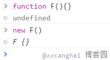
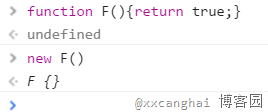
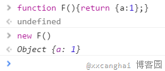

# 一道奇葩的跟new有关的面试题
> new
## 题目
```
function Foo() {
    getName = function () { alert (1); };
    return this;
}
Foo.getName = function () { alert (2);};
Foo.prototype.getName = function () { alert (3);};
var getName = function () { alert (4);};
function getName() { alert (5);}

//请写出以下输出结果：
Foo.getName();
getName();
Foo().getName();
getName();
new Foo.getName();
new Foo().getName();
new new Foo().getName();
```
## 第一问
先看此题的上半部分做了什么，首先定义了一个叫Foo的函数，之后为Foo创建了一个叫getName的静态属性存储了一个匿名函数，之后为Foo的原型对象新创建了一个叫getName的匿名函数。之后又通过函数变量表达式创建了一个getName的函数，最后再声明一个叫getName函数。

第一问的 Foo.getName 自然是访问Foo函数上存储的静态属性，自然是2，没什么可说的。

## 第二问
第二问，直接调用 getName 函数。既然是直接调用那么就是访问当前上文作用域内的叫getName的函数，所以跟1 2 3都没什么关系。此题有无数面试者回答为5。此处有两个坑，一是变量声明提升，二是函数表达式。

### 变量声明提升
即所有声明变量或声明函数都会被提升到当前函数的顶部。

例如下代码:
```
console.log('x' in window);//true
var x;
x = 0;
```
代码执行时js引擎会将声明语句提升至代码最上方，变为：
```
var x;
console.log('x' in window);//true
x = 0;
```
### 函数表达式
var getName 与 function getName 都是声明语句，区别在于 var getName 是函数表达式，而 function getName 是函数声明。
例如下代码：

```
console.log(x);//输出：function x(){}
var x=1;
function x(){}
```
实际执行的代码为，先将 var x=1 拆分为 var x; 和 x = 1; 两行，再将 var x; 和 function x(){} 两行提升至最上方变成：

```
var x;
function x(){}
console.log(x);
x=1;
```
所以最终函数声明的x覆盖了变量声明的x，log输出为x函数。

同理，原题中代码最终执行时的是：
```
function Foo() {
    getName = function () { alert (1); };
    return this;
}
var getName;//只提升变量声明
function getName() { alert (5);}//提升函数声明，覆盖var的声明

Foo.getName = function () { alert (2);};
Foo.prototype.getName = function () { alert (3);};

getName = function () { alert (4);};//最终的赋值再次覆盖function getName声明

getName();//最终输出4
```

## 第三问
第三问的 Foo().getName(); 先执行了Foo函数，然后调用Foo函数的返回值对象的getName属性函数。

Foo函数的第一句  getName = function () { alert (1); };  是一句函数赋值语句，注意它没有var声明，所以先向当前Foo函数作用域内寻找getName变量，没有。再向当前函数作用域上层，即外层作用域内寻找是否含有getName变量，找到了，也就是第二问中的alert(4)函数，将此变量的值赋值为 function(){alert(1)}。 

此处实际上是将外层作用域内的getName函数修改了。

> 注意：此处若依然没有找到会一直向上查找到window对象，若window对象中也没有getName属性，就在window对象中创建一个getName变量。
> 之后Foo函数的返回值是this，而JS的this问题博客园中已经有非常多的文章介绍，这里不再多说。

简单的讲，this的指向是由所在函数的调用方式决定的。而此处的直接调用方式，this指向window对象。

遂Foo函数返回的是window对象，相当于执行 window.getName() ，而window中的getName已经被修改为alert(1)，所以最终会输出1

此处考察了两个知识点，一个是变量作用域问题，一个是this指向问题。

## 第四问
直接调用getName函数，相当于 window.getName() ，因为这个变量已经被Foo函数执行时修改了，遂结果与第三问相同，为1

但是！！！ 如果没有第四问的被Foo()函数执行修改
```
function Foo() {
    getName = function () { alert (1); };
    return this;
}
Foo.getName = function () { alert (2);};
Foo.prototype.getName = function () { alert (3);};
var getName = function () { alert (4);};
function getName() { alert (5);}

//答案：
getName();//4
```

## 第五问
第五问 new Foo.getName(); ,此处考察的是js的运算符优先级问题。


通过查上表可以得知点（.）的优先级高于new操作，遂相当于是:
```
new (Foo.getName)();
```
所以实际上将getName函数作为了构造函数来执行，遂弹出2。

## 第六问
第六问 new Foo().getName() ，首先看运算符优先级括号高于new，实际执行为
```
(new Foo()).getName()
```
遂先执行Foo函数，而Foo此时作为构造函数却有返回值，所以这里需要说明下js中的构造函数返回值问题。

### 构造函数的返回值
在传统语言中，构造函数不应该有返回值，实际执行的返回值就是此构造函数的实例化对象。

而在js中构造函数可以有返回值也可以没有。

1、没有返回值则按照其他语言一样返回实例化对象。


2、若有返回值则检查其返回值是否为引用类型。如果是非引用类型，如基本类型（string,number,boolean,null,undefined）则与无返回值相同，实际返回其实例化对象。


3、若返回值是引用类型，则实际返回值为这个引用类型。


原题中，返回的是this，而this在构造函数中本来就代表当前实例化对象，遂最终Foo函数返回实例化对象。

之后调用实例化对象的getName函数，因为在Foo构造函数中没有为实例化对象添加任何属性，遂到当前对象的原型对象（prototype）中寻找getName，找到了。

遂最终输出3。

但是！！！如果在构造函数中增加了属性
```
function Foo() {
    this.getName = function () { alert (1); };
    return this;
}
Foo.getName = function () { alert (2);};
Foo.prototype.getName = function () { alert (3);};
var getName = function () { alert (4);};
function getName() { alert (5);}

//答案：

new Foo().getName();//3
```

## 第七问
第七问, new new Foo().getName(); 同样是运算符优先级问题。

最终实际执行为：

new ((new Foo()).getName)();
先初始化Foo的实例化对象，然后将其原型上的getName函数作为构造函数再次new。

遂最终结果为3

## 答案
```
function Foo() {
    getName = function () { alert (1); };
    return this;
}
Foo.getName = function () { alert (2);};
Foo.prototype.getName = function () { alert (3);};
var getName = function () { alert (4);};
function getName() { alert (5);}

//答案：
Foo.getName();//2
getName();//4
Foo().getName();//1
getName();//1
new Foo.getName();//2
new Foo().getName();//3
new new Foo().getName();//3
```

## 来源
[一道常被人轻视的前端JS面试题](https://www.cnblogs.com/xxcanghai/p/5189353.html)