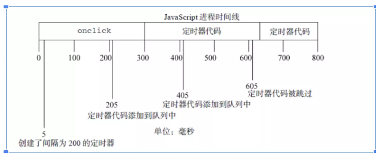
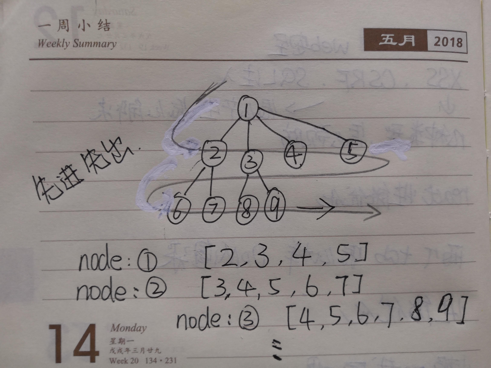
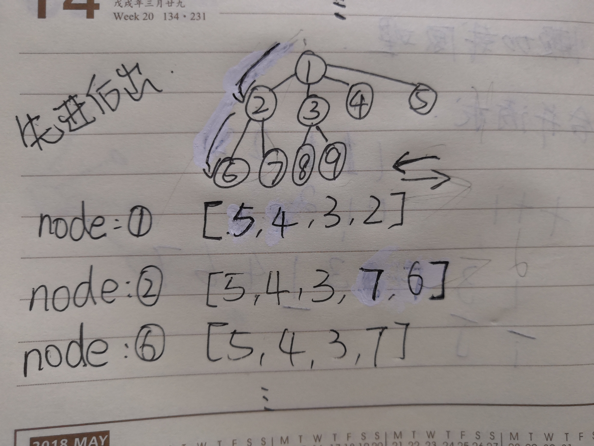

# 在线编程
* [1.数组去重](#1.数组去重)
* [2.找出数组arr中的重复元素](#2.找出数组arr中的重复元素)
* [3.浅拷贝](#3.浅拷贝)
* [4.深拷贝](#4.深拷贝)
* [5.使用setTimeout实现setInterval功能](#5.使用setTimeout实现setInterval功能)
* [6.遍历DOM树](#6.遍历DOM树)
  * [6.1二叉查找树的实现](#6.1二叉查找树的实现)
  * [6.2二叉DOM树的遍历](#6.2二叉DOM树的遍历)
  * [6.3多叉DOM树](#6.3多叉DOM树)
* [7.懒加载和预加载](#7.懒加载和预加载)
* [8.防抖和节流](#8.防抖和节流)
  * [8.1防抖之非立即执行版](#8.11防抖之非立即执行版)
  * [8.2防抖之立即执行版](#8.2防抖之立即执行版)
  * [8.3节流之时间戳版](#8.3节流之时间戳版)
  * [8.4节流之定时器版](#8.4节流之定时器版)

## 1.数组去重
> 编写一个数组去重的方法
```js
function arrayUnique(arr){
}
arrayUnique([1,3,4,3,1,4,6,7])
```

### 解法1：利用 ES6 中的 set
```js
const arrayUnique = (arr) => {
  return Array.from(new Set(arr));
}
arrayUnique([1,3,4,3,1,4,6,7]);
```

### 解法二：利用 splice 函数
```js
const arrayUnique = (arr) => {
  arr.sort((a,b) => a-b); // 先从小到大排序
  for(let i=0;i<arr.length;i++){
    if(arr[i] === arr[i+1]){
      arr.splice(i+1,1);
      i--;
    }
  }
  return arr;
}
arrayUnique([1,3,4,3,1,4,6,7]);
```

### 解法三：利用 ES6
arr.reduce(callback[, initialValue])
* callback：执行数组中每个值的函数，包含四个参数：
  * accumulator：累加器累加回调的返回值; 它是上一次调用回调时返回的累积值，或initialValue（如下所示）。
  * currentValue：数组中正在处理的元素。
  * currentIndex**可选**：数组中正在处理的当前元素的索引。 如果提供了initialValue，则索引号为0，否则为索引为1。
  * array**可选**：调用reduce的数组
* initialValue可选：用作第一个调用 callback的第一个参数的值。 如果没有提供初始值，则将使用数组中的第一个元素。 在没有初始值的空数组上调用 reduce 将报错。

```js
const colors = ["red","red","green","blue","green"];
const arrayUnique = colors.reduce((distinct, color) => 
    (distinct.indexOf(color) !== -1) ? distinct : [...distinct, color],
    []
)      
console.log(arrayUnique);               
```

### 解法四：利用 filter 函数
```js
const arr = [1,3,4,3,1,4,6,7];
const arrayUnique = arr.filter((item, index, _arr) => 
    _arr.indexOf(item) === index
  );
console.log(arrayUnique);
```

### 解法五：傻瓜法
```js
const arrayUnique = (arr) => {
  let res = [];
  for(let i=0;i<arr.length;i++){
    if(res.indexOf(arr[i]) === -1){
      res.push(arr[i]);
     }
   }
   return res;
}
arrayUnique([1,3,4,3,1,4,6,7]);
```

### 解法六：明明没什么技巧却绕死人的双重循环法
```js
// 大概就是前面有重复的跳过，取最后的没有重复的
const arrayUnique = (arr) => {
  let newArr = [];
  for(let i=0;i<arr.length;i++){
    for(let j=i+1;j<arr.length;j++){
      if(arr[i] === arr[j]){
        j = ++i;
      }
    }
    newArr.push(arr[i]);
  }
  return newArr;
}
arrayUnique([1,3,4,3,1,4,6,7]);
```

## 2.找出数组 arr 中的重复元素
### 解法一：排序后存入第一个，重复的跳过
```js
const duplicates = (arr) => {
  let res = [];
  arr.sort((a,b) => a-b);
  for(let i=0;i<arr.length-1;i++){
    if(arr[i]===arr[i+1]){
      res.push(arr[i]);
      while(arr[i] === arr[i+1]){ 
        i++; // 跳过相同的，注意上面还有一次i++
      }
     }
   }
   return res;
}
duplicates([1,3,4,3,1,4,6,7]);
```

### 解法二：
```js
const duplicates = (arr) => {
  if(Array.isArray(arr)){
    let repeat = arr.filter((item, index, _arr) => 
      _arr.indexOf(item) !== index
    );
    return [...new Set(repeat)];
  }
  return null;
}
duplicates([1,3,4,3,1,4,6,7]);
```

## 3.浅拷贝
浅拷贝：只复制一层对象的属性

#### 解法一：原生实现
```js
const shallowCopy = (sourceObj) => {
  if (typeof sourceObj !== 'object') return;
  let newObj = sourceObj instanceof Array ? [] : {};
  
  for(let key in sourceObj){ 
    if(sourceObj.hasOwnProperty(key)) {
     //只复制元素自身的属性，不复制原型链上的
      if(!(key in newObj)){
        newObj[key] = sourceObj[key];
      }
    }
  }
  return newObj;
}

let obj = { a:1, arr:[2,3]};
let res = shallowCopy(obj);
console.log(res.arr === obj.arr); // true，指向同一个引用
```

### 解法二：使用Object.assign()
```js
let obj = { a:1, arr:[2,3]};
let res = Object.assign({}, obj)

console.log(res.arr === obj.arr); // true，指向同一个引用
```
注意：Object.assign 方法只复制源对象中可枚举的属性和对象自身的属性。

### 解法三：使用 ES6 扩展运算符
```js
let obj = { a:1, arr:[2,3]};
let res = {...obj};

console.log(res.arr === obj.arr); // true，指向同一个引用
```

## 4.深拷贝
深复制：递归复制了所有层级。

### 解法一：json 序列化
```js
let obj = { a:1, arr:[2,3]};
let target = {};
let res = JSON.parse(JSON.stringify(obj));

console.log(res.arr === obj.arr); // false，指向不同的内存地址
```
注意：，会破坏原型链，并且无法拷贝属性值为 function 的属性

### 解法二：原生实现
```js
const deepCopy = (sourceObj) => {
  if(typeof sourceObj !== 'object') return;
  let newObj = sourceObj instanceof Array ? [] : {};
  
  for(let item in sourceObj){
    if(sourceObj.hasOwnProperty(item)) {
     //只复制元素自身的属性，不复制原型链上的
      newObj[item] = (typeof sourceObj[item] === 'object' ? deepCopy(sourceObj[item]) : sourceObj[item]);
     }
   }
   return newObj;
}

let obj = { a:1, arr:[2,3]};
let res = deepCopy(obj);
console.log(res.arr === obj.arr); // false，指向不同的内存地址
```

## 5.使用setTimeout实现setInterval功能
### 简答版
```js
const mySetInterval = (func, ms) => {
  const interval = () => {
    setTimeout(interval, ms);
    func();
  }
  setTimeout(interval, ms);
}

const test = () => console.log('log');
mySetInterval(test, 10);
```

### 优化版
增加了函数执行的次数
```js
const mySetInterval = (func, ms, count) => {
  const interval = () => {
    if(typeof count === 'undefined' || count-- >0){
      setTimeout(interval, ms);
      try{
        func();
      } catch(e){
         throw e.toString();
      }
    }
  }
  setTimeout(interval, ms);
}

const test = () => console.log('log');
mySetInterval(test, 10);
```

### 一与二的区别
```js
// 示例一
setTimeout(function(){
  console.log("小马");
  setTimeout(function(){arguments.callee;},1000);
},1000)
```
```js
// 示例二
setInterval(function(){
  console.log("小马");
},1000);
```
首先对于定时器函数 setTimeout/setInterval，JavaScript 有一个 **JS 引擎线程**在**同步栈**上执行**同步任务**，当遇到 setTimeout 时，由**定时触发器线程**去计时，计时完成之后将**回调函数**添加到**事件队列**当中，等待**同步栈**上的**同步任务**执行完成。

对于 setInterval，当**JS引擎线程**空闲的时候，将**事件队列**里面的**回调函数**推入**JS引擎线程**执行。

**有一个问题，定时器是等到回调执行完，才开始计时进行下次循环呢？还是只要一次计时完毕，将回调推入事件队列之后不管回调执不执行就开始计时呢？答案显然是后者**。

如果这个时候无限定时时间到了会再次插入回调，这个时候如果发现事件队列中的第一次回调没有执行，那么再次插入的回调浏览器就默认取消，（这是以防出现回调连续执行多次的情况）

弊端：
1. 某些间隔会被跳过
2. 多个定时器的代码执行时间可能会比预期小

* 每次 setTimeout 计时到后就会去执行，然后执行一段时间后才会继续setTimeout，中间就多了误差（误差多少与代码执行时间有关）
* 而 setInterval 则是每次都精确的隔一段时间推入一个事件（但是，事件的实际执行时间不一定就准确，还有可能是这个事件还没执行完毕，下一个事件就来了）

---
假设，某个onclick事件处理程序使用啦setInterval()来设置了一个200ms的重复定时器。如果事件处理程序花了300ms多一点的时间完成。



这个例子中的第一个定时器是在205ms处添加到队列中，但是要过300ms才能执行。在405ms又添加了一个副本。在一个间隔，605ms处，第一个定时器代码还在执行中，而且队列中已经有了一个定时器实例，结果是605ms的定时器代码不会添加到队列中。结果是在5ms处添加的定时器代码执行结束后，405处的代码立即执行。

用 setTimeout 避免这种情况
```
const say = () => {
  //something
  setTimeout(say,200);
}
setTimeout(say,200)
```
或者
```
setTimeout(() => {
   //do something
   setTimeout(arguments.callee,200);
},200);
```

## 6.遍历DOM树
### 6.1二叉查找树的实现
```js
class Node {
  constructor(key){
    this.key = key;
    this.left = undefined;
    this.right = undefined;
  }
}

```
```js
const Compare = {
  LESS_THAN: -1,
  BIGGER_THAN: 1,
  EQUALS: 0
};

const defaultCompare = (a, b) => {
  if (a === b) {
    return Compare.EQUALS;
  }
  return a < b ? Compare.LESS_THAN : Compare.BIGGER_THAN;
}
```
```js
class BinarySearchTree {
  constructor(compareFn = defaultCompare){
    this.compareFn = compareFn;
    this.root = undefined;
  }

  insert(key) {
    // 插入第一个节点
    if (this.root == null) {
      this.root = new Node(key);
    } else {
      this.insertNode(this.root, key);
    }
  }

   insertNode(node, key) {
    if (this.compareFn(key, node.key) === Compare.LESS_THAN) {
      if (node.left == null) {
        node.left = new Node(key);
      } else {
        this.insertNode(node.left, key);
      }
    } else if (node.right == null) {
      node.right = new Node(key);
    } else {
      this.insertNode(node.right, key);
    }
  }

  getRoot() {
    return this.root;
  }
  search(key) {
    return this.searchNode(this.root, key);
  }
  searchNode(node, key) {
    if (node == null) {
      return false;
    }
    if (this.compareFn(key, node.key) === Compare.LESS_THAN) {
      return this.searchNode(node.left, key);
    } else if (this.compareFn(key, node.key) === Compare.BIGGER_THAN) {
      return this.searchNode(node.right, key);
    }
    return true;
  }
   min() {
    return this.minNode(this.root);
  }
  minNode(node) {
    let current = node;
    while (current != null && current.left != null) {
      current = current.left;
    }
    return current;
  }
  max() {
    return this.maxNode(this.root);
  }
  maxNode(node) {
    let current = node;
    while (current != null && current.right != null) {
      current = current.right;
    }
    return current;
  }
  remove(key) {
    this.root = this.removeNode(this.root, key);
  }
  removeNode(node, key) {
    if (node == null) {
      return undefined;
    }
    if (this.compareFn(key, node.key) === Compare.LESS_THAN) {
      node.left = this.removeNode(node.left, key);
      return node;
    } else if (this.compareFn(key, node.key) === Compare.BIGGER_THAN) {
      node.right = this.removeNode(node.right, key);
      return node;
    }
    // key is equal to node.item
    // handle 3 special conditions
    // 1 - a leaf node
    // 2 - a node with only 1 child
    // 3 - a node with 2 children
    // case 1
    if (node.left == null && node.right == null) {
      node = undefined;
      return node;
    }
    // case 2
    if (node.left == null) {
      node = node.right;
      return node;
    } else if (node.right == null) {
      node = node.left;
      return node;
    }
    // case 3
    const aux = this.minNode(node.right);
    node.key = aux.key;
    node.right = this.removeNode(node.right, aux.key);
    return node;
  }
```
### 6.2二叉DOM树的遍历
#### 前序遍历
其中，前序遍历代码如下：首先访问根结点，然后遍历左子树，最后遍历右子树
```js
  preOrderTraverse(callback) {
    this.preOrderTraverseNode(this.root, callback);
  }
  preOrderTraverseNode(node, callback) {
    if (node != null) {
      callback(node.key);
      this.preOrderTraverseNode(node.left, callback);
      this.preOrderTraverseNode(node.right, callback);
    }
  }
```
修改为 DOM 二叉树：
```js
const preOrder = (node, cb) => {
  cb(node);
  if(node.firstElementChild){
    preOrder(node.firstElementChild, cb);
  }
  if(node.lastElementChild) {
     preOrder(node.lastElementChild,callback);
  }
}
```
非递归版本：
```js
const preOrder = (node, cb) => {
  let stack = [];
  while(node || stack.length){
    while(node){
      stack.push(node);
      cb(node);
      node = node.firstElementChild;
    }
    node = stack.pop();
    node = node.lastElementChild;
  }
}; 
```
---

#### 中序遍历
其中，中序遍历代码如下：首先遍历左子树，然后访问根结点，最后遍历右子树。
```js
  inOrderTraverse(callback) {
    this.inOrderTraverseNode(this.root, callback);
  }
  inOrderTraverseNode(node, callback) {
    if (node != null) {
      this.inOrderTraverseNode(node.left, callback);
      callback(node.key);
      this.inOrderTraverseNode(node.right, callback);
    }
  }
```
修改为 DOM 二叉树：
```js
const inOrder = (node, cb) => {
  if(node.firstElementChild){
    inOrder(node.firstElementChild, cb);
  }
  cb(node);
  if(node.lastElementChild) {
     inOrder(node.lastElementChild,callback);
  }
}
```
非递归版本：
```js
const inOrder = (node, cb) => {
  let stack = [];
  while(node || stack.length){
    while(node){
      stack.push(node);
      node = node.firstElementChild;
    }
    node = stack.pop();
    cb(node);
    node = node.lastElementChild;
  }
}; 
```
---

#### 后序遍历
其中，后序遍历代码如下：首先遍历左子树，然后遍历右子树，最后访问根结点。
```js
  postOrderTraverse(callback) {
    this.postOrderTraverseNode(this.root, callback);
  }
  postOrderTraverseNode(node, callback) {
    if (node != null) {
      this.postOrderTraverseNode(node.left, callback);
      this.postOrderTraverseNode(node.right, callback);
      callback(node.key);
    }
  }
```
修改为 DOM 二叉树：
```js
  const postOrder = (node, cb) => {
  if(node.firstElementChild){
    postOrder(node.firstElementChild, cb);
  }
  if(node.lastElementChild) {
     postOrder(node.lastElementChild,callback);
  }
  cb(node);
}
```
非递归版本：
```js
const postOrder = (node, cb) => {
  let stack = [];
  stack.push(node);
  stack.push(node);
  while(stack.length){
    node = stack.pop();
    if(stack.length && node === stack[stack.length-1]){
      if(node.lastElementChild) {
	    stack.push(node.lastElementChild);
	    stack.push(node.lastElementChild);
	  }
	  if(node.firstElementChild) {
	    stack.push(node.firstElementChild);
	    stack.push(node.firstElementChild);
      }
    }else{  
      cb(node);
    }
  }
}; 
```

### 6.3多叉DOM树
1. childNodes 属性，标准的，它返回指定**元素的子元素集合**，包括HTML节点，所有属性，文本。可以通过nodeType来判断是哪种类型的节点，只有当**nodeType==1时才是元素节点**，**2是属性节点**，**3是文本节点**。
2. children 属性，非标准的，它返回指定元素的子元素集合。它**只返回HTML节点**，甚至不返回文本节点。这个用的99%是这个功能来进行子节点功能的操作，且可以避免firstChildren与lastChildren的选取非元素节点的尴尬！

---

#### 广度优先遍历(Breadth First Search)
首先遍历根节点，然后访问第一层节点，第二层节点，....,直到访问到最后一层。

1. 借助于队列，用**非递归**的方式对多叉树进行遍历
```js
const treeBFS = (node, cb) => {
  let  queue = [];
  while(node){
    cb(node);
    let len = node.children.length;
    if(len !== 0){
      for(let i=0;i<len;i++){
        queue.push(node.children[i]); //借助于队列,暂存当前节点的所有子节点
      }
    }
    // 出来的是children
    node = queue.shift(); //先入先出，借助于数据结构：队列
  }
};
```


2. 递归写法
```js
const treeBFS = (node, cb) => {
  cb(node);
  node = node.firstElementChild;
  treeBFSNode(node,cb);
};
const treeBFSNode = (node, cb) => {
    if (!node) return; 
    let nodes = [];
    let i = 0;
    cb(node);
    nodes.push(node);
    // nextElementSibling属性只返回元素节点之后的兄弟元素节点
    treeBFSNode(node.nextElementSibling,cb);
    node = nodes[i++];
    treeBFSNode(node.firstElementChild,cb);
}   
```

#### 深度优先遍历(Depth First Search)
首先遍历根节点，然后沿着一条路径遍历到最深的一层，最后在逐层返回。

1. 借助于栈,实现多叉 DOM树 的**非递归**深度优先遍历。
```js
const treeDFS = (node, cb) => {
  let stack = [];
  while(node){
    cb(node);
    let len = node.children.length;
    if(len !== 0){
      for(let i=len-1;i>=0;i--){
        // 按照相反的子节点顺序压入栈
        stack.push(node.children[i]);// 将该节点的所有子节点压入栈
      }
    }
    // 弹出栈的子节点顺序就是原来的正确顺序(因为栈是先入后出的)
    node = stack.pop();
  }
};
```


2. 递归写法
```js
const treeDFS = (node, cb) => {
    if (!node) return; 
    let nodes = [];
    cb(node);
    nodes.push(node);
    let child = node.children;
    for(let i=0;i<child.length;i++){
	  treeDFS(child[i], cb);
	}
}
```


## 8.防抖和节流
### 8.1防抖之非立即执行版
```js
const debounce = (func, wait, ...args) => {
  let timeout;
  return function(){
    const context = this;
    if(timeout) clearTimeout(timeout); // 合并事件期间，清除定时器
    timeout = setTimeout(()=>{
      func.apply(context, args);
    },wait);
  }
}
```

### 8.2防抖之立即执行版
```js
const debounce = (func,wait,...args) => {
  let timeout;
  return function(){
    const context = this;
    if(timeout) clearTimeout(timeout);
    let callNow = !timeout;
    timeout = setTimeout(() => {
      timeout = null;
    },wait);
    
    if(callNow) func.apply(context,args);
  }
}
```

### 8.3节流之时间戳版
```js
const throttle = (func,wait,...args) => {
  let pre = 0;
  return function(){
    const context = this;
    let now = Date.now();
    if(now-pre >= wait){
       func.apply(context,args);
       pre = Date.now();
    }
  }
}
```
### 8.3节流之定时器版
```js
const throttle = (func,wait,..args) => {
  let timeout;
  return function(){
    const context = this;
    if (!timeout){
      timeout = setTimeout(()=>{
        timeout = null;
        func,apply(context,args);
      },wait)
    }
  }
}
```
