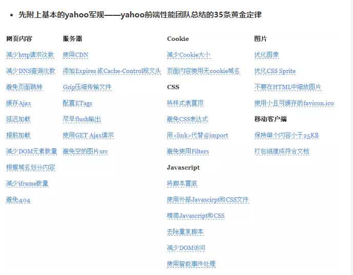

# 性能优化总结


## 代码执行方面
1. 因为JS引擎线程和GUI线程是互斥的，所以在脚本下载并执行完之前会阻塞页面渲染。所以需要将脚本放在结束标签之前。还有一种更好的方法是：在页面加载完成之后再加载JavaScript代码即无阻塞脚本：动态脚本元素、脚本注入
2. 局部变量位于作用域链的起始位置，全局变量处于作用域链的末端。属性或方法在原型链中位置越深，访问速度越慢。所以可以通过把对象成员（原型链）、数组元素、跨域变量（作用域链）保存在局部变量改善性能，因为访问速度更快。

## 页面渲染方面
1. 减少重绘和重排：当需要批量修改 DOM 时，可以通过元素 display 隐藏之后，操作拷贝，元素显示来减少重排次数，将 n 次重排变成一次重排。
2. 事件委托：利用事件逐级冒泡并能被父级元素捕捉，使用事件代理，给外层元素绑定事件处理器，就可以处理子元素上触发的所有事件。以此减少事件处理器的数量。
3. 图片懒加载：利用scroll事件监听滚动事件，但是不断触发事件可能会降低性能。可以利用**函数节流和函数去抖**改善性能。图片预加载，提前加载重要内容。
4. 让动画元素脱离文档流。比如absolute设置元素脱离文档流，让元素动起来，当它扩大时会临时覆盖部分页面，这只是页面的一个小区域的重绘，然后恢复定位就只会发生一次重排。
5. 浏览器尝试通过队列化修改和批量执行的方式最小化重排次数，当我们查询布局信息时，会导致强制刷新队列。因此我们可以减少布局信息获取的次数，即第一次获取将其赋值给局部变量，再操作局部变量。

## 网络方面
1. 缓存：当某一文件在浏览器中第一次被访问的时候，这个时候浏览器是没有缓存的，直接从服务器获取文件，返回给客户端，并且存入浏览器缓存；此时，返回状态码200，并且服务端可以设置响应头部Expires或者Cache-Control控制缓存有效期
2. 减少请求的次数：文件合并，雪碧图，base64编码小图片放到CSS中
3. 使用CDN，将一个服务器的内容，平均分部到多个服务器上，服务器智能识别，让用户获取离用户最近的服务器，提高访问速度。
  * 缺点:因为他是缓存文件,如果在网站更新了内容,部分电脑,可能不会实时的更新过来,它需要将CDN那台计算机的内容也更新了,客户的显示器上内容才是最新的,这个时间可能需要几小时,甚至半天.所以对于经常更新的网站,并不是很适合用CDN加速.
  * 优点：读写分离，负载均衡，资源服务器与应用服务器的分离
4. 预解析DNS：过 DNS 预解析来告诉浏览器未来我们可能从某个特定的 URL 获取资源，当浏览器真正使用到该域中的某个资源时就可以尽快地完成 DNS 解析。
```
<link rel="dns-prefetch" href="//example.com">
```
另外需要注意的是，**浏览器会对a标签的href自动启用DNS Prefetching，所以a标签里包含的域名不需要在head中手动设置link。但是在HTTPS下不起作用，需要meta来强制开启功能**。这个限制的原因是防止窃听者根据DNS Prefetching推断显示在HTTPS页面中超链接的主机名。下面这句话作用是强制打开a标签域名解析
```
<meta http-equiv="x-dns-prefetch-control" content="on">
```

