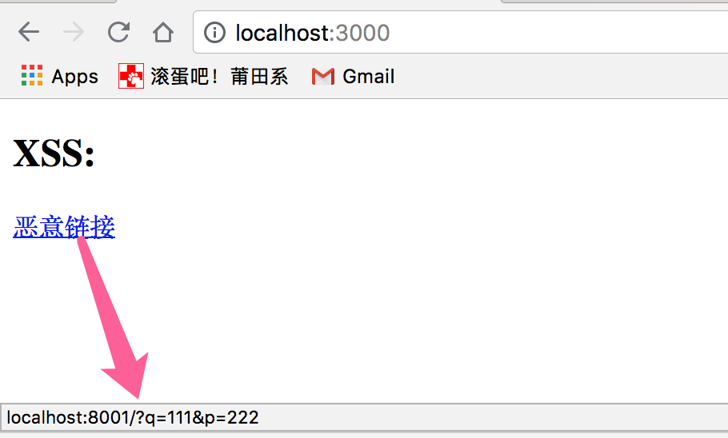
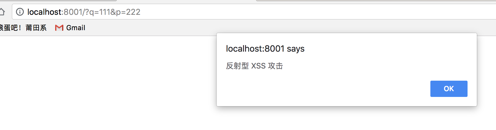

# XSS
> XSS

## 介绍
XSS，即 Cross Site Script，中译是**跨站脚本攻击**；其原本缩写是 CSS，但为了和层叠样式表(Cascading Style Sheet)有所区分，因而在安全领域叫做 XSS。

XSS 攻击是**指攻击者在网站上注入恶意的客户端代码，通过恶意脚本对客户端网页进行篡改，从而在用户浏览网页时，对用户浏览器进行控制或者获取用户隐私数据的一种攻击方式**。

攻击者对客户端网页注入的恶意脚本一般包括 JavaScript，有时也会包含 HTML 和 Flash。有很多种方式进行 XSS 攻击，但它们的共同点为：将一些隐私数据像 cookie、session 发送给攻击者，将受害者重定向到一个由攻击者控制的网站，在受害者的机器上进行一些恶意操作。

XSS 分为三种：反射型，存储型和 DOM-based

## 攻击方式
### 反射型
反射型 XSS 只是简单地**把用户输入的数据 “反射” 给浏览器，这种攻击方式往往需要攻击者诱使用户点击一个恶意链接，或者提交一个表单，或者进入一个恶意网站时，注入脚本进入被攻击者的网站**。

看一个示例。我先准备一个如下的静态页：



恶意链接的地址指向了 localhost:8001/?q=111&p=222。然后，我再启一个简单的 Node 服务处理恶意链接的请求：
```js
const http = require('http');
function handleReequest(req, res) {
    res.setHeader('Access-Control-Allow-Origin', '*');
    res.writeHead(200, {'Content-Type': 'text/html; charset=UTF-8'});
    res.write('<script>alert("反射型 XSS 攻击")</script>');
    res.end();
}

const server = new http.Server();
server.listen(8001, '127.0.0.1');
server.on('request', handleReequest);
```
当用户点击恶意链接时，页面跳转到攻击者预先准备的页面，会发现在攻击者的页面执行了 js 脚本：



这样就产生了反射型 XSS 攻击。攻击者可以注入任意的恶意脚本进行攻击，可能注入恶作剧脚本，或者注入能获取用户隐私数据(如cookie)的脚本，这取决于攻击者的目的。

### 存储型
**存储型 XSS 会把用户输入的数据 "存储" 在服务器端，当浏览器请求数据时，脚本从服务器上传回并执行。这种 XSS 攻击具有很强的稳定性**。

比较常见的一个场景是攻击者在社区或论坛上写下一篇包含恶意 JavaScript 代码的文章或评论，文章或评论发表后，所有访问该文章或评论的用户，都会在他们的浏览器中执行这段恶意的 JavaScript 代码。

举一个示例。

先准备一个输入页面：
```html
<input type="text" id="input">
<button id="btn">Submit</button>   

<script>
    const input = document.getElementById('input');
    const btn = document.getElementById('btn');

    let val;
     
    input.addEventListener('change', (e) => {
        val = e.target.value;
    }, false);

    btn.addEventListener('click', (e) => {
        fetch('http://localhost:8001/save', {
            method: 'POST',
            body: val
        });
    }, false);
</script>
```
启动一个 Node 服务监听 save 请求。为了简化，用一个变量来保存用户的输入：
```js
const http = require('http');

let userInput = '';

function handleReequest(req, res) {
    const method = req.method;
    res.setHeader('Access-Control-Allow-Origin', '*');
    res.setHeader('Access-Control-Allow-Headers', 'Content-Type')
    
    if (method === 'POST' && req.url === '/save') {
        let body = '';
        req.on('data', chunk => {
            body += chunk;
        });

        req.on('end', () => {
            if (body) {
                userInput = body;
            }
            res.end();
        });
    } else {
        res.writeHead(200, {'Content-Type': 'text/html; charset=UTF-8'});
        res.write(userInput);
        res.end();
    }
}

const server = new http.Server();
server.listen(8001, '127.0.0.1');

server.on('request', handleReequest);
```
当用户点击提交按钮将输入信息提交到服务端时，服务端通过 userInput 变量保存了输入内容。当用户通过 http://localhost:8001/${id} 访问时，服务端会返回与 id 对应的内容(本示例简化了处理)。如果用户输入了恶意脚本内容，则其他用户访问该内容时，恶意脚本就会在浏览器端执行。

### DOM-based
基于 DOM 的 XSS 攻击是指通过恶意脚本修改页面的 DOM 结构，是纯粹发生在客户端的攻击。

看如下代码：
```JS
<h2>XSS: </h2>
<input type="text" id="input">
<button id="btn">Submit</button>
<div id="div"></div>
<script>
    const input = document.getElementById('input');
    const btn = document.getElementById('btn');
    const div = document.getElementById('div');

    let val;
     
    input.addEventListener('change', (e) => {
        val = e.target.value;
    }, false);

    btn.addEventListener('click', () => {
        div.innerHTML = `<a href=${val}>testLink</a>`
    }, false);
</script>
```
点击 Submit 按钮后，会在当前页面插入一个链接，其地址为用户的输入内容。如果用户在输入时构造了如下内容：
```
'' onclick=alert(/xss/)
```
用户提交之后，页面代码就变成了：
```
<a href onlick="alert(/xss/)">testLink</a>
```
此时，用户点击生成的链接，就会执行对应的脚本

## 防范方法
现在主流的浏览器内置了防范 XSS 的措施，例如 CSP。但对于开发者来说，也应该寻找可靠的解决方案来防止 XSS 攻击。

### CSP
内容安全策略 (CSP) 是一个额外的安全层，用于检测并削弱某些特定类型的攻击，包括跨站脚本 (XSS) 和数据注入攻击等。无论是数据盗取、网站内容污染还是散发恶意软件，这些攻击都是主要的手段。

我们可以通过 CSP 来尽量减少 XSS 攻击。CSP 本质上也是**建立白名单**，**规定了浏览器只能够执行特定来源的代码**。

通常可以通过 HTTP Header 中的 Content-Security-Policy 来开启 CSP

* 只允许加载本站资源
```
Content-Security-Policy: default-src ‘self’
```
* 只允许加载 HTTPS 协议图片
```
Content-Security-Policy: img-src https://*
```
* 允许加载任何来源框架
```
Content-Security-Policy: child-src 'none'
```

### HttpOnly 防止劫取 Cookie
HttpOnly 最早由微软提出，至今已经成为一个标准。浏览器将禁止页面的 Javascript 访问带有 HttpOnly 属性的Cookie。

上文有说到，攻击者可以通过注入恶意脚本获取用户的 Cookie 信息。通常 Cookie 中都包含了用户的登录凭证信息，攻击者在获取到 Cookie 之后，则可以发起 Cookie 劫持攻击。所以，严格来说，HttpOnly 并非阻止 XSS 攻击，而是能阻止 XSS 攻击后的 Cookie 劫持攻击。

### 输入检查
不要相信用户的任何输入。 对于用户的任何输入要进行检**查、过滤和转义**。**建立可信任的字符和 HTML 标签白名单，对于不在白名单之列的字符或者标签进行过滤或编码**。

在 XSS 防御中，输入检查一般是检查用户输入的数据中是否包含 <，> 等特殊字符，如果存在，则对特殊字符进行过滤或编码，这种方式也称为 XSS Filter。

而在一些前端框架中，都会有一份 **decodingMap**， 用于对用户输入所包含的特殊字符或标签进行编码或过滤，如 <，>，script，防止 XSS 攻击：
```js
// vuejs 中的 decodingMap
// 在 vuejs 中，如果输入带 script 标签的内容，会直接过滤掉
const decodingMap = {
  '&lt;': '<',
  '&gt;': '>',
  '&quot;': '"',
  '&amp;': '&',
  '&#10;': '\n'
}
```

### 输出检查
用户的输入会存在问题，服务端的输出也会存在问题。一般来说，除富文本的输出外，在变量输出到 HTML 页面时，可以使用编码或转义的方式来防御 XSS 攻击。例如利用 [sanitize-html](https://github.com/punkave/sanitize-html) 对输出内容进行有规则的过滤之后再输出到页面中。
```js
function escape(str) {
	str = str.replace(/&/g, "&amp;");
	str = str.replace(/</g, "&lt;");
	str = str.replace(/>/g, "&gt;");
	str = str.replace(/"/g, "&quto;");
	str = str.replace(/'/g, "&##39;");
	str = str.replace(/`/g, "&##96;");
    str = str.replace(/\//g, "&##x2F;");
    return str
}
```
对于显示富文本来说，不能通过上面的办法来转义所有字符，因为这样会把需要的格式也过滤掉。这种情况通常采用白名单过滤的办法，当然也可以通过黑名单过滤，但是考虑到需要过滤的标签和标签属性实在太多，更加推荐使用白名单的方式。


